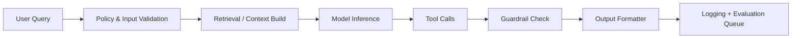

AI 에이전트는 데모에서는 잘 동작하지만, 운영 환경에서는 품질 편차·비용 폭증·예상치 못한 행동으로 쉽게 실패합니다.  
이 글은 에이전트를 제품으로 운영하기 위해 필요한 준비도를 체크리스트와 지표 중심으로 정리합니다.

## 운영 준비도를 보는 4개 축

| 축 | 핵심 질문 | 필수 산출물 |
|---|---|---|
| 품질 | 답변이 일관되게 유효한가 | 평가셋, 자동/수동 평가 리포트 |
| 안전 | 정책 위반과 민감정보 노출을 막는가 | 가드레일 규칙, 차단 로그 |
| 비용 | 요청당 원가를 통제 가능한가 | 토큰/도구 호출 단가 대시보드 |
| 운영 | 장애 시 복구가 빠른가 | 알람 룰, 장애 대응 런북 |

## 에이전트 요청 처리 파이프라인

## 품질 기준 정의

에이전트 품질은 "좋아 보이는 답변"이 아니라 "업무 목적을 달성했는지"로 측정해야 합니다.

| 지표 | 설명 | 권장 기준(예시) |
|---|---|---|
| Task Success Rate | 목적 작업 완료율 | 85% 이상 |
| Hallucination Rate | 근거 없는 사실 비율 | 3% 이하 |
| Tool Success Rate | 도구 호출 성공률 | 98% 이상 |
| Retry Rate | 재시도 필요 비율 | 10% 이하 |

## 비용 설계

비용은 모델 단가보다 "불필요한 반복 호출"에서 크게 발생합니다.

1. **질문 분류**: 단순 질의는 경량 모델 우선  
2. **컨텍스트 축소**: 무조건 긴 문맥 전달 금지  
3. **도구 호출 제한**: 최대 호출 횟수와 시간 제한  
4. **캐시 전략**: 반복 질문은 답변 캐시 활용

### 비용 추적 표 예시

| 항목 | 계산 방식 | 모니터링 주기 |
|---|---|---|
| 요청당 평균 토큰 | 총 토큰 / 요청 수 | 실시간 |
| 도구 호출 비용 | 도구 단가 x 호출 수 | 일간 |
| 실패 재시도 비용 | 재시도 요청 x 평균 토큰 | 일간 |
| 사용자당 월간 비용 | 월간 총 비용 / MAU | 주간 |

## 보안 및 정책 가드레일

- 프롬프트 인젝션 패턴 사전 탐지  
- 민감정보(PII, 키, 토큰) 마스킹  
- 금지 작업(결제/삭제 등) 승인 워크플로 강제  
- 모든 응답에 정책 검사 후 반환

## 운영 장애 대응 시나리오

| 장애 유형 | 초기 증상 | 1차 대응 | 2차 대응 |
|---|---|---|---|
| 응답 품질 급락 | CS 급증, 재질문 증가 | 모델 버전 롤백 | 평가셋 재학습 |
| 비용 급증 | 토큰 사용량 급등 | 호출 상한 임시 축소 | 캐시/분류 정책 수정 |
| 도구 연쇄 실패 | 시간초과, 오류 누적 | 장애 도구 우회 | 회로차단기 임계값 조정 |
| 안전 위반 응답 | 정책 경고 탐지 | 응답 차단 및 알림 | 룰셋 업데이트 |

## 30-60-90일 실행 로드맵

| 기간 | 목표 | 실행 내용 |
|---|---|---|
| 1~30일 | 기준선 구축 | 평가셋, 로그 구조, 비용 대시보드 |
| 31~60일 | 안정화 | 가드레일 룰, 자동 평가, 알람 고도화 |
| 61~90일 | 최적화 | 모델 라우팅, 캐시 전략, A/B 실험 |

## 최종 점검 체크리스트

- [ ] 오프라인 평가셋과 온라인 지표가 연결되어 있는가  
- [ ] 정책 위반 차단 로그를 주기적으로 리뷰하는가  
- [ ] 비용 상한선과 초과 대응 정책이 있는가  
- [ ] 모델/프롬프트 변경 시 회귀 테스트가 있는가  
- [ ] 장애 시 수동 대응 절차가 문서화되어 있는가

## 결론

AI 에이전트 운영의 핵심은 모델 성능 자체보다 "운영 시스템의 성숙도"입니다.  
품질·안전·비용·운영을 동시에 설계하면, 데모 수준을 넘어 신뢰 가능한 서비스로 성장시킬 수 있습니다.

