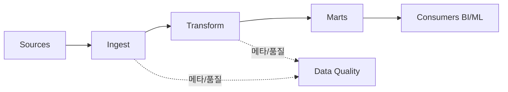

데이터 파이프라인에서 가장 비싼 버그는 **조용히 틀린 집계**입니다.  
대시보드는 멀쩡해 보이는데 숫자만 틀리면, 의사결정 전체가 흔들립니다.

## 레이어 구조

| 레이어 | 책임 | 실패 시 증상 |
|---|---|---|
| Ingest | 원천 수집, 스키마 적용 | 누락·지연 |
| Transform | 비즈니스 규칙, 집계 | 잘못된 KPI |
| Serve | 웨어하우스·마트·API | 느린 쿼리·불일치 |
| Observe | 지연·품질·볼륨 알람 | 사고 후 발견 |

## Idempotency·증분 설계

| 패턴 | 적합 상황 |
|---|---|
| 스냅샷 덮어쓰기 | 작은 테이블, 일 배치 |
| 증분 + 워터마크 | 대용량 이벤트 스트림 |
| SCD Type 2 | 이력 추적이 필요한 차원 |

## 데이터 품질 검증 예시

| 검증 유형 | 예 |
|---|---|
| 스키마 | 필수 컬럼, 타입, 범위 |
| 참조 무결성 | 키 존재 여부 |
| 통계 | 행 수 급변, NULL 비율 |
| 비즈니스 규칙 | 매출 = 수량 × 단가 |

## 운영 지표

| 지표 | 의미 |
|---|---|
| 파이프라인 지연 | SLA 위반 여부 |
| 실패율 | 안정성 |
| 재처리 횟수 | 설계/데이터 품질 |
| 다운스트림 피드백 | 신뢰도 |

## 체크리스트

- [ ] 동일 입력에 대해 재실행해도 결과가 동일한가  
- [ ] 실패 시 부분 결과가 소비자에게 노출되지 않는가  
- [ ] 스키마 변경에 대한 마이그레이션 계획이 있는가  
- [ ] 품질 검증 실패 시 알람과 롤백 경로가 있는가  

## 결론

데이터 엔지니어링은 **파이프라인 코드**와 **품질·관측 계약**을 동시에 만드는 일입니다.  
집계 로직이 아무리 우아해도, 검증과 지연이 없으면 조직은 데이터를 믿지 않게 됩니다.
