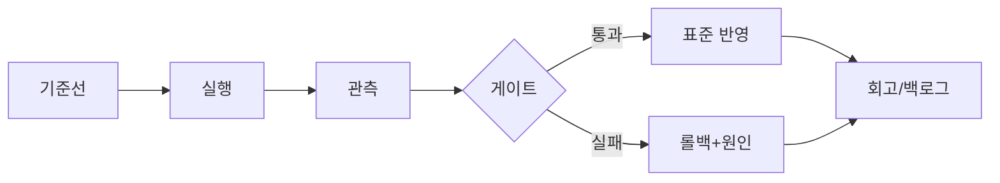

## 왜 이 문서가 필요한가

이 글의 초점은 **데이터 시각화 실전 가이드 2026: 보기 좋은 차트가 아니라 판단 가능한 대시보드**과(와) 관련해 현장에서 반복되는 결정을 줄이는 데 있습니다. 같은 논의가 매 스프린트마다 다시 열리면 속도와 품질이 동시에 떨어집니다. 지표 정의, 실행 순서, 롤백 기준, 회고 연결을 최소한의 공통 언어로 고정해 두기 위한 운영 문서입니다.

## 핵심 원칙

| 원칙 | 실무 적용 |
|---|---|
| 기준선 우선 | 숫자 없는 개선 논의 금지 |
| 단일 변경 | 한 번에 변수는 하나만 |
| 게이트 명시 | 통과/실패 조건을 문장으로 |
| 회고 연결 | 결론은 백로그 항목으로 |

## 실행 절차

1. **현재 상태 수치화**: 최근 2주 지표로 기준선을 남깁니다.  
2. **가설과 범위**: 이번 주에 바꿀 행동과 기대 효과를 한 문단으로 적습니다.  
3. **실행 및 관측**: 변경 후 48~72시간은 회귀 신호를 집중 관측합니다.  
4. **판정**: 게이트를 통과하면 표준에 반영, 실패하면 롤백하고 원인 코드를 남깁니다.  
5. **문서 갱신**: 다음 사람이 같은 실수를 하지 않도록 본 문서를 업데이트합니다.

## 체크리스트

- 이 문서만 읽고도 신규 담당자가 같은 절차를 재현할 수 있는가  
- 실패 시 “누가·언제·어떻게” 롤백하는지 한 화면에 있는가  
- 성공 정의가 수치 또는 명확한 완료 조건으로 적혀 있는가  
- 지난 회고에서 나온 액션이 실제로 반영되었는가  

### 실전 시나리오

데이터 시각화 실전 가이드 2026: 보기 좋은 차트가 아니라 판단 가능한 대시보드과 관련해 흔한 패턴은 “문서는 있는데 최신 운영과 어긋난다”는 것입니다. 예를 들어 임계값만 바꾸고 문서의 기준은 그대로 두면, 장애 때마다 논쟁이 재발합니다. 반대로 변경 사항을 즉시 문서에 반영하고 버전 메모를 남기면, 팀의 판단 속도가 안정됩니다.

## 마무리

운영 문서의 품질은 분량이 아니라 **재사용성**으로 측정됩니다. 이 글을 팀 주간 리뷰에 붙여 두고, 매주 한 항목씩만 개선해도 분기마다 운영 성숙도가 달라집니다.

## 참고문헌

- [Google Technical Writing](https://developers.google.com/tech-writing)
- [Diátaxis documentation framework](https://diataxis.fr/)
- [OWASP Secure Coding Practices](https://owasp.org/www-project-secure-coding-practices-quick-reference-guide/)
