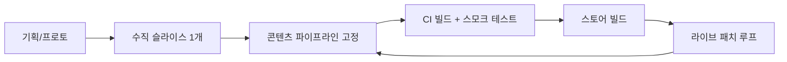

인디 게임에서 가장 흔한 실패는 **아이디어 부족이 아니라 파이프라인 부재**입니다.  
에셋·빌드·배포·패치·지표가 한 줄로 이어지지 않으면, 후반으로 갈수록 수정 비용이 기하급수로 늘어납니다.

## 단계별 목표와 산출물

| 단계 | 목표 | 산출물 |
|---|---|---|
| Discover | 재미의 핵심 가설 검증 | 1~2주 내 플레이 가능한 프로토타입 |
| Productionize | 반복 가능한 제작 루프 | 에셋·씬·스크립트 규칙 문서 |
| Ship | 안정 빌드와 스토어 제출 | 릴리스 체크리스트, 크래시 리포트 |
| Live | 운영과 밸런스 | 이벤트·패치 주기, KPI 대시보드 |

## 개발 파이프라인 흐름

## 빌드·배포 최소 세트

| 항목 | 권장 |
|---|---|
| 버전 규칙 | 시맨틱 버전 또는 빌드 번호 단일 소스 |
| 브랜치 | `main` 보호, 릴리스 태그로 스토어 연동 |
| 자동화 | 야간/PR마다 스모크 빌드 |
| 크래시 | 크래시 리포팅 SDK + 심볼 업로드 |

## 라이브 운영 지표(예시)

| 지표 | 의미 |
|---|---|
| D1/D7 리텐션 | 초기 재미·난이도·튜토리얼 품질 |
| 세션 길이 | 루프 설계 적합성 |
| 이탈 구간 | 콘텐츠·밸런스 병목 |
| 크래시율 | 기술 부채·QA 커버리지 |

## 30일 실행 체크리스트

- [ ] “재미 가설”을 한 문장으로 쓰고 프로토로 검증했는가  
- [ ] 에셋 폴더·네이밍·임포트 규칙을 팀이 공유하는가  
- [ ] 릴리스 전 스모크 시나리오 10개 이상이 있는가  
- [ ] 크래시·로그 수집 경로가 연결되어 있는가  
- [ ] 패치 주기(주간/격주)를 캘린더에 고정했는가  

## 결론

인디 게임의 경쟁력은 그래픽 스펙이 아니라 **반복 가능한 제작·출시·운영 루프**에서 나옵니다.  
파이프라인을 먼저 얇게라도 고정하면, 후반 콘텐츠 확장이 훨씬 덜 고통스럽습니다.
