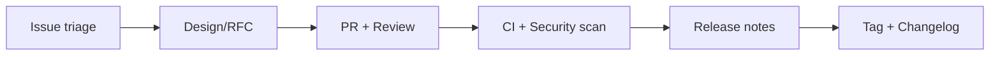

오픈소스는 코드를 공개하는 순간 끝나는 것이 아니라, **결정권·시간·에너지를 어떻게 나눌지**가 시작입니다.  
거버넌스가 없으면 기여는 늘지만 메인테이너는 번아웃되고, 릴리스는 멈춥니다.

## 거버넌스 최소 구성

| 요소 | 내용 |
|---|---|
| 비전 | 프로젝트가 하지 않는 것까지 명시 |
| 역할 | 메인테이너, 커미터, 기여자 정의 |
| 의사결정 | RFC, 투표, BDFL 등 규칙 |
| 행동 강령 | CoC 링크와 집행 경로 |

## 기여·PR 운영 표준

| 규칙 | 목적 |
|---|---|
| 이슈 템플릿 | 재현 단계·환경 수집 |
| PR 크기 가이드 | 리뷰 가능 단위 유지 |
| 라벨 체계 | 우선순위·난이도·영역 |
| stale 정책 | 고아 이슈 정리 |

## 릴리스·버전 정책

- 시맨틱 버전과 호환성 정책(메이저 브레이킹 정의)을 README에 고정  
- CHANGELOG 자동화 또는 PR 단위 기록 의무화  
- 보안 패치는 별도 채널(보안 이메일, GH Security Advisory) 명시  

## 보안 체크리스트

- [ ] 의존성 취약점 스캔(CI 또는 주간)  
- [ ] 시크릿 커밋 방지(hooks 또는 CI)  
- [ ] 메인테이너 2인 이상(버스 팩터)  
- [ ] 보안 정책 SECURITY.md 게시  

## 결론

성공한 오픈소스는 스타 수가 아니라 **지속 가능한 유지보수 구조**로 판별됩니다.  
템플릿·라벨·릴리스·보안만 표준화해도 기여 품질과 메인테이너 체력이 동시에 좋아집니다.
