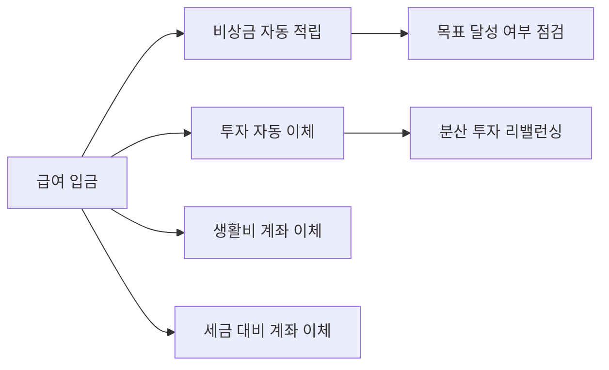

연봉이 오르는 것과 자산이 늘어나는 것은 다릅니다.  
개발자는 업무 자동화에는 익숙하지만, 개인 재무는 여전히 수동 관리하는 경우가 많습니다. 이 글은 재무를 "시스템"으로 운영하는 방법을 다룹니다.

## 재무 자동화의 기본 원칙

1. **먼저 저축, 나중 소비**: 월급일 자동 이체  
2. **계좌 분리**: 생활비/비상금/투자금 분리  
3. **규칙 기반 투자**: 감정이 아닌 사전 규칙 실행  
4. **리스크 우선**: 수익률보다 생존 기간 확보

## 계좌 구조 예시

| 계좌 | 역할 | 권장 자동화 |
|---|---|---|
| 생활비 계좌 | 고정/변동 지출 | 월 예산 자동 이체 |
| 비상금 계좌 | 3~6개월 생계비 | 월 정액 자동 적립 |
| 투자 계좌 | 장기 자산 형성 | 월 정기 매수 |
| 세금/연말정산 계좌 | 세금 대비 | 프리랜서/부수입 비율 적립 |

## 월간 현금흐름 대시보드(예시)

| 항목 | 금액(원) | 비율 |
|---|---:|---:|
| 순수입 | 5,000,000 | 100% |
| 고정지출 | 1,800,000 | 36% |
| 변동지출 | 900,000 | 18% |
| 저축/비상금 | 900,000 | 18% |
| 투자 | 1,000,000 | 20% |
| 자기계발 | 400,000 | 8% |

## 자동화 흐름

## 개발자에게 맞는 투자 원칙(보수적)

- 단기 예측보다 장기 분산 우선  
- 고정 비용이 늘수록 현금성 자산 비중 상향  
- 레버리지는 소득 변동성이 낮을 때만 제한적으로  
- 투자 판단 기록을 남겨 감정 의사결정 방지

## 재무 리스크 체크표

| 리스크 | 경고 신호 | 대응 |
|---|---|---|
| 소득 단절 | 프로젝트/회사 리스크 증가 | 비상금 6개월 상향 |
| 건강/사고 | 의료비 급증 가능성 | 보험/현금성 자산 점검 |
| 과도한 소비 | 카드값 상승 추세 | 한도/자동 알림 설정 |
| 과투자 | 변동성 스트레스 증가 | 자산배분 재조정 |

## 분기 리뷰 질문

1. 자동 이체가 실제 목표 비율대로 실행되는가?  
2. 소비 항목 중 반복 낭비가 있는가?  
3. 투자 원칙을 어긴 거래가 있었는가?  
4. 소득 구조(본업/부업/배당)가 건강한가?

## 실행 체크리스트

- [ ] 급여일 기준 자동 이체 4종(생활비/저축/투자/세금) 설정  
- [ ] 카드/구독/고정비를 월 1회 점검  
- [ ] 분기별 자산배분 리밸런싱 수행  
- [ ] 비상금 목표액 달성 전 고위험 투자 제한  
- [ ] 재무 대시보드를 10분 이내로 업데이트 가능하게 구성

## 결론

재무는 의지보다 구조가 중요합니다.  
자동 이체와 계좌 분리, 정기 리뷰만으로도 돈 문제의 대부분은 "결정 피로" 없이 관리할 수 있습니다.

