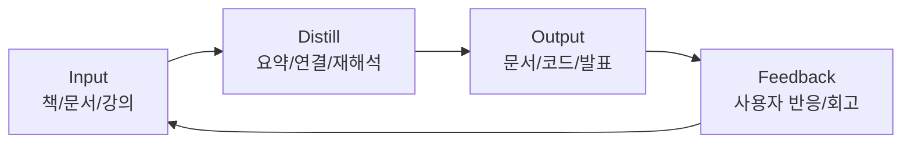

많이 읽어도 남지 않는 이유는, 학습이 "입력"에서 끝나기 때문입니다.  
지식관리 시스템(PKM)은 정보를 모으는 도구가 아니라, 생각을 축적해 결과물로 내보내는 생산 시스템입니다.

## 기본 구조: Input -> Distill -> Output

## 노트 계층 설계

| 계층 | 목적 | 형식 |
|---|---|---|
| Capture 노트 | 빠른 수집 | 짧은 메모, 링크, 핵심 문장 |
| Working 노트 | 사고 정리 | 문제-가설-근거 구조 |
| Evergreen 노트 | 장기 자산 | 개념 정의, 사례, 반례 |
| Output 노트 | 결과물 생산 | 블로그, 문서, 발표 초안 |

## 태그와 링크 전략

태그는 검색용, 링크는 사고 확장용으로 역할을 나눠야 합니다.

- 태그: 도메인/상태/우선순위 (`#ai`, `#todo`, `#review`)  
- 링크: 원인-결과, 비교, 선후 관계 (`[[RAG]] -> [[Vector DB]]`)  
- 허브 노트: 특정 주제의 인덱스 페이지 역할

## 주간 운영 루틴(실행형)

| 요일 | 핵심 작업 | 산출물 |
|---|---|---|
| 월 | 주간 목표 설정 | 우선순위 노트 1개 |
| 화-수 | 입력 + 실험 | Working 노트 2~3개 |
| 목 | 연결/정리 | Evergreen 노트 1개 |
| 금 | 출력 | 블로그/문서 초안 1개 |
| 일 | 회고 | 폐기할 노트 목록 + 개선점 |

## 노트 품질 점검표

| 질문 | 예/아니오 |
|---|---|
| 이 노트는 "내 언어"로 재작성되었는가 | |
| 다른 노트와 최소 2개 이상 연결되어 있는가 | |
| 실제 업무/프로젝트에 바로 적용 가능한가 | |
| 3개월 뒤에도 읽을 가치가 있는가 | |

## 흔한 실패와 해결책

| 실패 패턴 | 원인 | 해결 |
|---|---|---|
| 노트가 쌓이기만 함 | 출력 루틴 부재 | 주 1회 결과물 강제 |
| 태그 과다 | 분류 기준 불명확 | 태그 15개 이내 유지 |
| 도구 집착 | 구조보다 앱 기능에 집중 | 템플릿 최소화 |
| 회고 없음 | 개선 포인트 누락 | 월간 리뷰 캘린더 고정 |

## 30일 부트스트랩 계획

1. 1주차: 노트 계층과 템플릿 최소 구조 만들기  
2. 2주차: 입력 채널 3개로 제한(문서, 책, 회의)  
3. 3주차: Evergreen 노트 5개 작성  
4. 4주차: 블로그 글 2개 출력 및 회고

## 체크리스트

- [ ] 매주 최소 1개의 출력물을 만들고 있는가  
- [ ] 노트 재작성 비율이 단순 복붙보다 높은가  
- [ ] 정보 입력 채널이 과도하게 많지 않은가  
- [ ] 링크 기반으로 지식 그래프가 자라고 있는가  
- [ ] 분기마다 구조를 단순화하고 있는가

## 결론

좋은 지식관리 시스템은 "많이 저장하는 시스템"이 아니라 "자주 꺼내 쓰는 시스템"입니다.  
입력-정리-출력 루프를 유지하면 공부는 기록을 넘어, 실제 성과와 기회로 연결됩니다.

