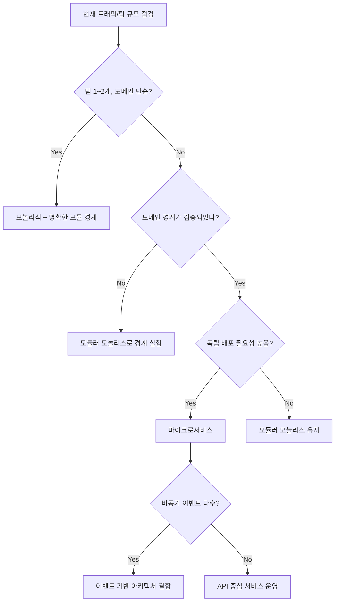

아키텍처는 "멋진 구조"를 고르는 일이 아니라, 팀과 비즈니스가 버틸 수 있는 시스템을 고르는 일입니다.  
이 글은 모놀리식, 모듈러 모놀리스, 마이크로서비스, 이벤트 기반 아키텍처를 어떤 조건에서 선택해야 하는지 실전 기준으로 설명합니다.

## 왜 아키텍처 선택이 중요한가

- 초기 선택은 배포 속도와 장애 범위를 동시에 결정합니다.
- 잘못된 전환 타이밍은 기능 개발보다 마이그레이션에 더 많은 시간을 쓰게 만듭니다.
- 팀의 커뮤니케이션 구조는 코드 구조로 그대로 반영됩니다.

## 패턴별 핵심 비교

| 패턴 | 장점 | 리스크 | 추천 상황 |
|---|---|---|---|
| 모놀리식 | 단순한 배포, 빠른 시작 | 코드 결합도 증가 | 소규모 팀, 빠른 MVP |
| 모듈러 모놀리스 | 경계 명확화, 단일 배포 유지 | 모듈 규칙이 약하면 무너짐 | 성장 초기, 도메인 분리 준비 |
| 마이크로서비스 | 팀 자율성, 독립 배포 | 운영 복잡도 급증 | 다수 팀, 도메인 경계 확정 |
| 이벤트 기반 | 확장성, 비동기 처리 최적화 | 디버깅 난이도 상승 | 고처리량, 워크플로 자동화 |

## 의사결정 흐름도

## 전환 전략: 모놀리식 -> 모듈러 -> 서비스 분리

### 1) 경계부터 먼저 고정

서비스 분리는 "코드 잘라내기"가 아니라 "책임 분리"입니다.  
먼저 도메인별 입력/출력 계약을 문서화하고, 데이터 소유권을 정의해야 합니다.

| 항목 | 질문 | 산출물 |
|---|---|---|
| 도메인 경계 | 어떤 기능을 누가 책임지는가 | 도메인 맵 |
| API 계약 | 어떤 입력/출력을 보장하는가 | API 스펙 |
| 데이터 소유권 | 어떤 서비스가 원본인가 | 데이터 권한 표 |
| 장애 전파 | 실패 시 어디까지 영향이 가는가 | 장애 시나리오 |

### 2) 운영 지표를 먼저 심는다

전환 전에 관측 지표를 넣지 않으면, 전환 후 성능 회귀를 발견하지 못합니다.

- API별 P95/P99 지연시간
- 도메인별 오류율
- 배포 성공률
- 롤백 소요 시간

### 3) 스트랭글러 패턴으로 단계적 분리

한 번에 전체 재작성하지 말고, 트래픽이 높은 도메인부터 분리합니다.

1. 경계 명확한 도메인 하나 선택  
2. 읽기 트래픽부터 새 경로로 라우팅  
3. 안정화 후 쓰기 트랜잭션 이관  
4. 기존 경로 제거

## 실제 운영에서 자주 실패하는 패턴

| 실패 유형 | 원인 | 개선 방법 |
|---|---|---|
| 서비스 수만 늘어남 | 도메인 경계 없이 분리 | 도메인 이벤트 기준으로 재정의 |
| 장애 원인 추적 불가 | 분산 추적/로그 상관관계 부재 | 공통 요청 ID와 트레이싱 강제 |
| 배포 속도 저하 | 파이프라인 복잡도 과다 | 표준 템플릿과 자동 검증 도입 |
| 데이터 일관성 이슈 | 분산 트랜잭션 오남용 | 사가 패턴 + 보상 트랜잭션 |

## 90일 실행 계획

| 기간 | 목표 | 핵심 작업 |
|---|---|---|
| 1~30일 | 현황 가시화 | 도메인 맵, 병목 API, 핵심 지표 수집 |
| 31~60일 | 경계 실험 | 모듈 인터페이스 정리, 계약 테스트 도입 |
| 61~90일 | 부분 분리 | 우선 도메인 1개 분리, 관측/알람 안정화 |

## 체크리스트

- [ ] 팀이 공통 도메인 용어를 합의했는가  
- [ ] 성능/에러 기준선(Baseline)을 측정했는가  
- [ ] 서비스 분리 대상에 명확한 비즈니스 이유가 있는가  
- [ ] 롤백 계획이 문서화되어 있는가  
- [ ] 운영/개발이 같은 대시보드를 보는가

## 결론

좋은 아키텍처는 "최신 패턴"이 아니라 "현재 조직의 실행 능력"과 맞는 구조입니다.  
모놀리식에서 시작해도 괜찮고, 중요한 것은 경계를 먼저 설계하고 지표를 기반으로 단계적으로 전환하는 것입니다.

