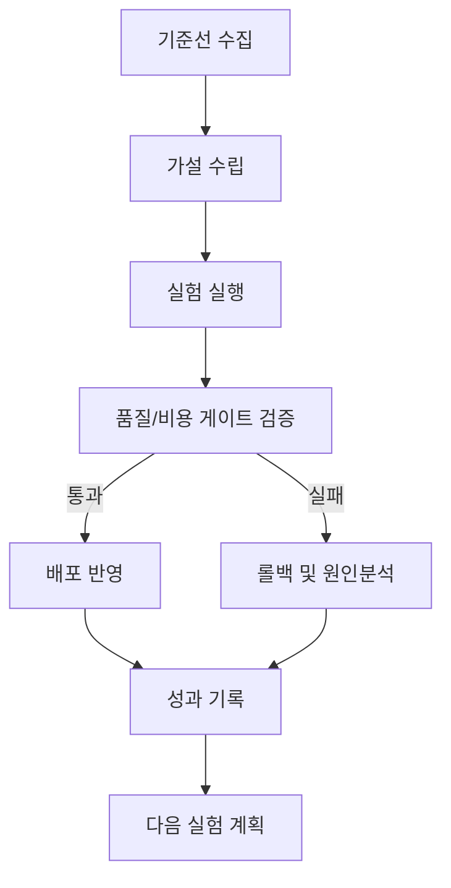

## 왜 이 문서가 필요한가

이 문서의 핵심 목표는 **품질을 유지한 상태로 비용 절감** 입니다.  
실무에서는 속도와 품질, 비용이 동시에 충돌하므로 단일 지표로는 운영 의사결정을 내리기 어렵습니다. 아래 구조를 기준으로 운영하면, 실험 결과를 팀 자산으로 축적하면서도 릴리즈 안정성을 유지할 수 있습니다.

## 운영 지표 표준

| 지표 | 정의 | 목표 |
|---|---|---|
| 단위비용 | 요청당 평균 비용 | -15% |
| 품질보존 | 핵심 품질지표 변화 | ±2% 이내 |
| 실험속도 | 월간 실험 건수 | >= 8건 |

## 실행 절차

1. **기준선 설정**: 최근 2주 데이터를 기준으로 현재 상태를 수치화합니다.  
2. **실험 설계**: 가설 1개당 변경점 1개 원칙으로 실험을 분리합니다.  
3. **게이트 검증**: 품질 하한을 넘지 못하면 배포를 중단합니다.  
4. **운영 반영**: 통과 실험만 프로덕션에 반영하고 변경 로그를 남깁니다.

## 체크리스트

- 입력/출력 샘플셋이 최신 데이터 분포를 반영하는가
- 품질 하한과 비용 상한이 사전에 합의되었는가
- 실패 시 롤백 경로와 담당자가 명확한가
- 실험 결과가 다음 스프린트 백로그에 반영되는가

## 운영 플로우

## 마무리

핵심은 문서를 많이 만드는 것이 아니라, 각 문서가 실제 운영 행동으로 이어지도록 만드는 것입니다.  
이 템플릿을 팀 주간 리뷰에 연결하면, 실험-검증-배포-회고가 하나의 루프로 작동합니다.
