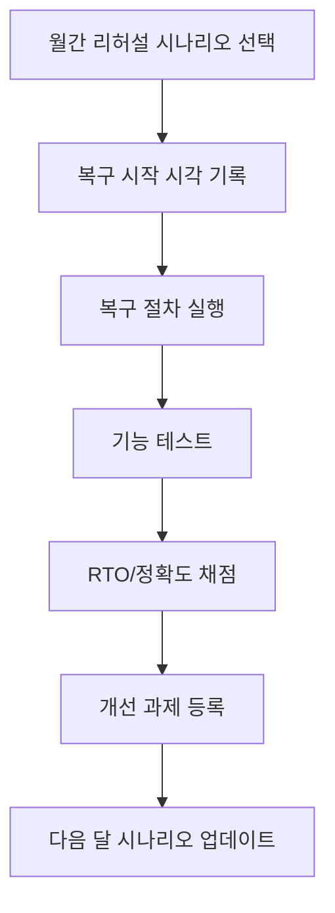

백업 성공 메시지는 안정감을 주지만, 실제 장애 상황에서는 거의 의미가 없습니다. 진짜 질문은 하나입니다. "지금 당장 복구할 수 있는가?" 복구 리허설이 없는 백업은 보험증권 없는 보험과 같습니다. 이 글은 홈랩에서 부담 없이 지속할 수 있는 복구 리허설 루틴을 제안합니다.

리허설은 거창할 필요가 없습니다. 월 1회, 30~60분, 시나리오 1개만 수행해도 충분합니다. 중요한 것은 빈도와 반복입니다.

| 시나리오 | 목표 |
|---|---|
| 단일 파일 복구 | 작업 중 실수 복구 검증 |
| 서비스 설정 복구 | 운영 구성 재현성 검증 |
| VM/컨테이너 복원 | 핵심 서비스 RTO 검증 |

리허설 절차 권장안:
1. 시나리오 선택(파일/서비스/VM 중 1개)
2. 시작 시각 기록
3. 복구 실행
4. 서비스 정상 동작 확인
5. 종료 시각 및 이슈 기록
6. 개선 항목 1~2개만 다음 달 과제로 등록

복구 리허설에서 가장 중요한 지표는 두 가지입니다. **복구 시간(RTO)**, **복구 정확도(정상 동작 여부)**. 이 두 지표가 쌓이면 홈랩이 훨씬 덜 불안해집니다.

## 복구 리허설 점수표

복구 리허설은 \"성공/실패\"만 기록하면 개선이 어렵습니다. 최소한 아래 항목을 점수화하면, 다음 달에 무엇을 고쳐야 할지 명확해집니다.

| 평가 항목 | 질문 | 점수 범위 |
|---|---|---|
| 준비도 | 백업 위치/계정 정보가 즉시 준비됐는가 | 1~5 |
| 속도 | 목표 RTO 내 복구를 완료했는가 | 1~5 |
| 정확도 | 복구 후 서비스 기능이 정상인가 | 1~5 |
| 문서성 | 절차/이슈/개선안이 기록됐는가 | 1~5 |

## 월간 운영 플로우

마지막으로, 리허설 결과는 반드시 문서로 남기세요. 사람이 바뀌지 않아도 시간이 지나면 기억은 사라집니다. "지난번에 어떻게 복구했는지"를 문서로 볼 수 있어야 다음 장애 대응 속도가 빨라집니다.
