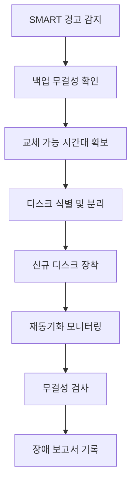

디스크 장애는 홈랩에서 가장 자주 만나지만 가장 늦게 대응하는 문제입니다. 이유는 단순합니다. 시스템이 완전히 죽기 전까지는 체감이 약하기 때문입니다. 하지만 SMART 경고가 처음 뜬 순간부터는 이미 "예방"이 아니라 "피해 최소화" 단계입니다. 이 글은 디스크 장애를 감정적으로 대응하지 않고, 체크리스트 기반으로 처리하는 방법을 제시합니다.

먼저 증상을 단계로 나눕니다. 1단계는 경고(재할당 섹터 증가, 읽기 오류 증가), 2단계는 성능 저하(IO wait 증가), 3단계는 장애(마운트 실패, 재동기화 실패)입니다. 단계별 대응이 다르기 때문에 구분이 중요합니다.

| 단계 | 대표 신호 | 권장 액션 |
|---|---|---|
| 경고 | SMART attribute 상승 | 즉시 백업 무결성 점검 + 예비 디스크 준비 |
| 성능 저하 | 재시도 읽기 증가, 지연 급등 | 쓰기 부하 축소 + 교체 계획 확정 |
| 장애 | 디스크 인식 실패 | 장애 디스크 분리 + 복구 절차 실행 |

핵심은 "교체 전에 백업 상태를 확인"하는 것입니다. 의외로 많은 운영자가 디스크 교체부터 시작합니다. 그러나 백업이 오래되었거나 복구 테스트가 없으면 교체 작업 자체가 큰 리스크가 됩니다.

실무 절차는 다음 순서가 안전합니다.

1. 현재 스토리지 상태 스냅샷(풀 상태/SMART/로그) 저장  
2. 최신 백업 성공 여부 확인  
3. 교체 대상 디스크 식별(물리 슬롯 포함)  
4. 야간/저부하 시간대 교체 작업 수행  
5. 재동기화 진행률 모니터링  
6. 완료 후 무결성 검사 및 복구 리허설  

많이 놓치는 포인트는 온도와 진동입니다. 디스크 장애는 개별 제품 불량만이 아니라 열 정체, 진동 누적, 전원 품질 문제와 함께 나타납니다. 교체 후에도 재발한다면 하드웨어 환경(팬 커브, 케이지 장착 상태, PSU 안정성)을 같이 점검해야 합니다.

## 교체 의사결정 기준

단순히 SMART 경고가 떴다고 즉시 전원을 내리면, 오히려 서비스 중단 시간이 길어질 수 있습니다. 반대로 경고를 무시하면 장애가 확정된 상태에서 야간 긴급 대응으로 이어집니다. 그래서 사전에 \"의사결정 기준\"을 문서화해 두는 것이 중요합니다.

| 항목 | 기준선 | 즉시 조치 조건 |
|---|---|---|
| 재할당 섹터 수 | 장기 추세 관찰 | 24시간 내 급격한 증가 |
| 읽기 오류 | 낮은 빈도 허용 | 동일 디스크 반복 오류 |
| 디스크 온도 | 정상 범위 유지 | 고온 상태 장시간 지속 |
| 풀 상태 | 정상/성능 저하 | 복구 불가 또는 degraded 고착 |

## 운영 플로우

마지막으로, 장애 대응 로그를 남기세요. 어떤 속성 값에서 경고가 시작됐고, 교체까지 며칠이 걸렸고, 복구에 몇 시간이 걸렸는지 기록하면 다음 장애 대응 품질이 확실히 올라갑니다.
