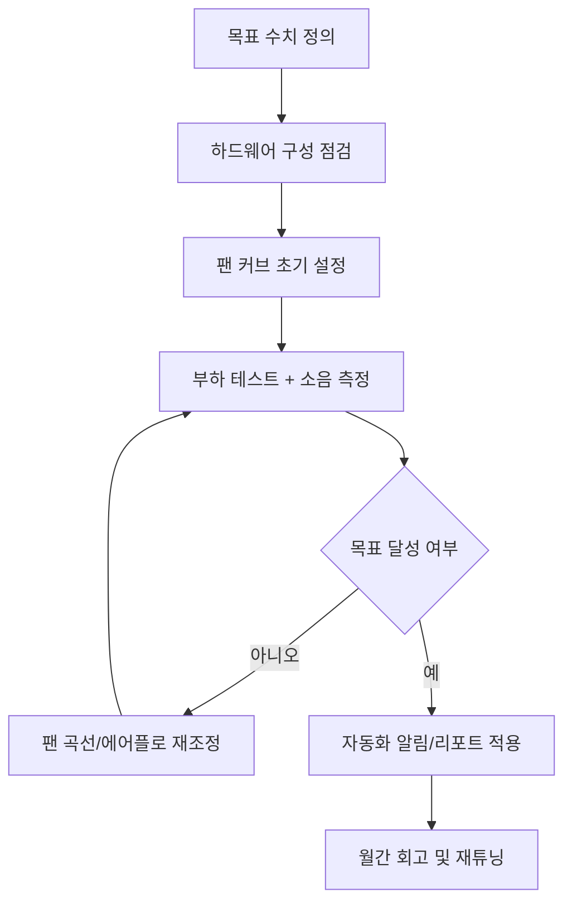

---
title: "홈랩 저소음 서버 설계 가이드 2026: 발열·소음·전력 균형 잡는 실전 체크리스트"
date: 2025-12-20T10:17:00+09:00
lastmod: 2025-12-23T10:17:00+09:00
description: "홈랩 환경에서 서버 소음과 발열을 동시에 낮추면서 안정성을 유지하는 설계 방법을 정리합니다."
slug: "homelab-low-noise-server-design-guide-2026"
categories: ["hardware-lab"]
tags: ["홈랩", "저소음", "쿨링", "전력", "서버"]
draft: false
---

## 왜 이 글이 필요한가

홈랩 서버를 오래 운영하면 결국 세 가지 문제가 동시에 옵니다.  
첫째는 소음, 둘째는 발열, 셋째는 전기요금입니다. 문제는 이 셋이 서로 연결되어 있어서, 한 가지만 고치면 다른 하나가 악화되기 쉽다는 점입니다.

이 글은 **저소음**, **안정성**, **전력 효율**을 동시에 고려하는 설계 기준을 제시합니다.

## 목표 수치 먼저 정하기

| 항목 | 권장 목표 | 측정 방법 |
|---|---|---|
| 아이들 소음 | 30~34 dBA | 스마트폰 소음계 + 1m 거리 |
| 풀로드 소음 | 40 dBA 이하 | CPU+스토리지 동시 부하 10분 |
| CPU 온도 | 85도 이하 | `lm-sensors` / BIOS 모니터링 |
| SSD 온도 | 70도 이하 | SMART 온도 로그 |
| 월 전력 사용량 | 예산 기준선 대비 -10% | 스마트 플러그 누적 전력 |

목표가 있어야 튜닝 방향을 잃지 않습니다.

## 하드웨어 구성 원칙

| 구성 요소 | 저소음 우선 선택 기준 | 피해야 할 선택 |
|---|---|---|
| 케이스 | 전면 흡기 면적이 넓고 120/140mm 팬 지원 | 통풍구 적은 밀폐형 |
| CPU 쿨러 | 타워형 히트싱크 + 저RPM 팬 | 소형 고RPM 쿨러 |
| 시스템 팬 | PWM 제어 가능한 저소음 모델 | 고정 RPM 팬 |
| PSU | 80+ Gold 이상, 저부하 팬리스/세미팬리스 | 저효율 구형 PSU |
| 스토리지 | OS용 NVMe + 데이터용 저RPM HDD 분리 | 고속 HDD 다중 집적 |

## 팬 커브 튜닝 기본값

아래 값은 시작점입니다. 이후 실제 온도 로그로 미세 조정합니다.

| 센서 온도 | 팬 속도 |
|---|---|
| 40도 이하 | 20% |
| 50도 | 35% |
| 60도 | 50% |
| 70도 | 70% |
| 80도 이상 | 100% |

핵심은 **급격한 팬 속도 변화(헌팅)**를 피하는 것입니다. 상승/하강 지연 시간을 3~5초 정도 주면 체감 소음을 줄일 수 있습니다.

## 배선/에어플로 체크리스트

- 전면 흡기 라인에 케이블이 걸리지 않도록 정리했는가
- 흡기와 배기 방향이 명확히 분리되어 있는가
- HDD 케이지 주변에 열 정체 구간이 없는가
- 메인보드 VRM, NVMe 방열판에 직접 바람이 닿는가
- 필터 먼지 누적을 월 1회 점검하는가

## 운영 자동화 추천

| 자동화 항목 | 방법 | 효과 |
|---|---|---|
| 온도 알림 | 임계치 초과 시 텔레그램/디스코드 알림 | 과열 조기 대응 |
| 전력 리포트 | 일/주간 소비 전력 자동 집계 | 비용 가시화 |
| 팬 프로파일 전환 | 야간/주간 프로파일 분리 | 소음 최적화 |
| SMART 점검 | 주간 배치로 디스크 상태 검사 | 장애 예방 |

## 운영 흐름

## 마무리

조용한 홈랩 서버는 비싼 부품보다 **측정-조정-기록** 루프에서 나옵니다.  
이 글의 표와 체크리스트를 기준으로 운영하면, 체감 소음을 줄이면서도 안정성을 유지하는 구성을 만들 수 있습니다.
