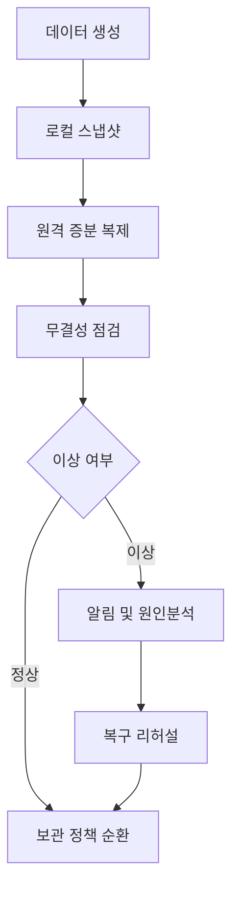

---
title: "홈랩 NAS 백업 아키텍처 2026: 3-2-1 전략을 실제 운영으로 고정하는 방법"
date: 2026-01-01T08:00:00+09:00
lastmod: 2026-01-01T08:00:00+09:00
description: "홈랩 NAS 환경에서 3-2-1 백업 전략을 실무적으로 운영하는 설계, 점검표, 자동화 루틴을 정리합니다."
slug: "homelab-nas-backup-architecture-2026"
categories: ["hardware-lab"]
tags: ["홈랩", "NAS", "백업", "3-2-1", "복구"]
draft: false
---

## 왜 백업이 실패하는가

대부분의 홈랩 백업은 "스크립트가 돌아간다"에서 멈춥니다.  
하지만 실제 장애는 스크립트 실패가 아니라 **복구 실패**에서 발생합니다.

- 파일은 있는데 버전이 너무 오래됨
- 스냅샷은 있는데 랜섬웨어로 같이 암호화됨
- 원격 백업은 있는데 복원 시간이 너무 오래 걸림

그래서 핵심은 백업 횟수가 아니라 **복구 가능성**입니다.

## 먼저 목표를 수치로 고정하기

| 항목 | 목표 | 설명 |
|---|---|---|
| RPO | 24시간 이내 | 하루치 데이터 손실 한도 |
| RTO | 4시간 이내 | 주요 서비스 복구 목표 시간 |
| 백업 성공률 | 98% 이상 | 월 단위 작업 성공 비율 |
| 복구 리허설 | 월 1회 이상 | 실제 복원 테스트 |

이 지표가 없으면 백업은 "돌아갔다" 수준에서 끝나고, 운영 품질이 올라가지 않습니다.

## 3-2-1을 홈랩에 맞게 구현하기

| 원칙 | 홈랩 적용 예시 |
|---|---|
| 3 copies | 원본 + 로컬 스냅샷 + 원격 사본 |
| 2 media | NAS 디스크 + 외장 디스크(또는 별도 스토리지) |
| 1 offsite | 원격 서버/클라우드/다른 장소 NAS |

권장 구성:
- 원본: 메인 NAS 데이터셋
- 로컬: 4시간 단위 스냅샷 7일 보관
- 원격: 일 1회 증분 복제 + 주 1회 무결성 점검

## 스냅샷/복제 정책 샘플

| 데이터 유형 | 스냅샷 주기 | 보관 기간 | 원격 복제 |
|---|---|---|---|
| 문서/설정 | 4시간 | 30일 | 일 1회 |
| 사진/영상 | 12시간 | 60일 | 주 3회 |
| VM/컨테이너 | 6시간 | 14일 | 일 1회 |
| 로그/캐시 | 필요 시 | 3일 | 제외 가능 |

## 자동화 체크리스트

- 백업 작업 종료 후 실패 코드 알림 발송
- 백업 크기 급감/급증 시 이상 알림
- 주간 무결성 검증(`checksum`/`scrub`) 실행
- 월간 랜덤 복구 테스트 자동 일정 등록

## 복구 테스트 시나리오

| 시나리오 | 테스트 절차 | 통과 기준 |
|---|---|---|
| 단일 파일 삭제 | 스냅샷에서 파일 복원 | 5분 내 복원 |
| 폴더 손상 | 전일 시점 폴더 전체 롤백 | 데이터 정합성 100% |
| NAS 장애 | 원격 사본에서 임시 서비스 기동 | 4시간 내 핵심 서비스 가동 |

## 운영 플로우

## 하드웨어 관점에서 자주 놓치는 것

- **UPS 미적용**: 정전 순간 파일시스템 손상 확률 증가
- **동일 전원 멀티탭**: 메인/백업 동시 장애 가능성
- **동일 공간 보관**: 화재/침수 시 오프사이트 효과 없음
- **SMART 경고 무시**: 백업 드라이브가 먼저 죽는 사례 빈번

## 결론

백업 설계의 본질은 저장이 아니라 복구입니다.  
이 글의 표와 체크리스트를 그대로 운영 루틴에 넣으면, 홈랩 NAS도 "취미 구성"을 넘어 "서비스 운영" 수준으로 올라갑니다.
