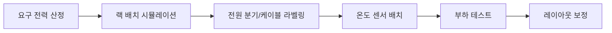

홈랩 랙 구성에서 실패하는 가장 흔한 패턴은 "장비부터 넣는 것"입니다. 장비를 먼저 사서 채우면 전원, 발열, 케이블, 유지보수 동선이 뒤엉킵니다. 랙 설계의 본질은 장비를 담는 것이 아니라 장애가 났을 때 빠르게 접근하고 복구할 수 있는 구조를 만드는 것입니다.

첫 단계는 열 방향을 고정하는 것입니다. 앞에서 흡기, 뒤에서 배기라는 기본 원칙이 흐려지면 같은 전력으로도 온도가 급격히 올라갑니다. 두 번째는 전원 계층 분리입니다. 네트워크 코어 장비와 테스트 장비를 분리하면 전체 다운 가능성을 줄일 수 있습니다.

| 영역 | 권장 배치 |
|---|---|
| 상단 | 패치 패널, 경량 네트워크 장비 |
| 중단 | 스위치, 라우터, 메인 서버 |
| 하단 | UPS, 무거운 NAS/스토리지 |

케이블은 길이보다 라벨이 중요합니다. 길이는 나중에 정리할 수 있지만, 라벨이 없으면 장애 때 선 하나 뽑는 결정이 매우 위험해집니다. 최소 기준은 "양쪽 라벨"입니다. 또한 전원 케이블과 데이터 케이블을 가능한 분리하면 노이즈와 정리 난이도를 함께 줄일 수 있습니다.

운영 체크리스트:
- 월 1회 먼지/흡기필터 점검
- 분기 1회 전원 이중화 테스트
- 반기 1회 케이블 라벨 검증
- 온도 센서 위치 재점검(상/중/하)

## 전원과 열을 동시에 보는 설계 표

전력 계획과 열 설계를 분리하면 문제가 반복됩니다. 소비 전력이 늘어난 장비는 대부분 열도 같이 올리기 때문에, 랙 설계에서는 두 요소를 한 표에서 관리해야 합니다.

| 장비군 | 평균 전력 | 열 영향 | 배치 원칙 |
|---|---|---|---|
| 코어 네트워크 | 낮음~중간 | 국소 발열 | 상단/중단, 전면 흡기 확보 |
| 메인 서버 | 중간~높음 | 지속 발열 | 중단, 앞뒤 공기 흐름 직선화 |
| 스토리지/NAS | 중간 | 장시간 발열 | 하단, 진동 억제 패드 적용 |
| UPS | 대기 전력 상시 | 열 축적 | 하단, 주변 여유 공간 확보 |

## 랙 운영 플로우

좋은 랙은 처음부터 완벽한 랙이 아니라, 변경이 쉬운 랙입니다. 비워둔 1U 공간 하나가 유지보수 시간을 크게 줄여줍니다.
