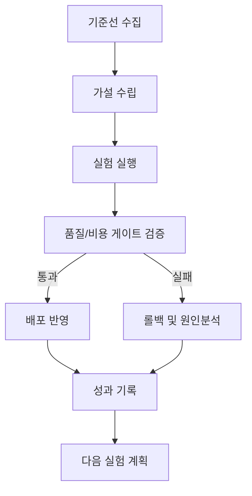

## 왜 이 문서가 필요한가

이 문서의 핵심 목표는 **릴리즈 전 회귀를 사전에 차단** 입니다.  
실무에서는 속도와 품질, 비용이 동시에 충돌하므로 단일 지표로는 운영 의사결정을 내리기 어렵습니다. 아래 구조를 기준으로 운영하면, 실험 결과를 팀 자산으로 축적하면서도 릴리즈 안정성을 유지할 수 있습니다.

## 운영 지표 표준

| 지표 | 정의 | 목표 |
|---|---|---|
| 회귀율 | 릴리즈 후 품질 하락 비율 | <= 3% |
| 승인시간 | 검증~배포 리드타임 | <= 1일 |
| 차단정확도 | 게이트 차단 적중률 | >= 85% |

## 실행 절차

1. **기준선 설정**: 최근 2주 데이터를 기준으로 현재 상태를 수치화합니다.  
2. **실험 설계**: 가설 1개당 변경점 1개 원칙으로 실험을 분리합니다.  
3. **게이트 검증**: 품질 하한을 넘지 못하면 배포를 중단합니다.  
4. **운영 반영**: 통과 실험만 프로덕션에 반영하고 변경 로그를 남깁니다.

## 체크리스트

- 입력/출력 샘플셋이 최신 데이터 분포를 반영하는가
- 품질 하한과 비용 상한이 사전에 합의되었는가
- 실패 시 롤백 경로와 담당자가 명확한가
- 실험 결과가 다음 스프린트 백로그에 반영되는가

## 운영 플로우

## 마무리

핵심은 문서를 많이 만드는 것이 아니라, 각 문서가 실제 운영 행동으로 이어지도록 만드는 것입니다.  
이 템플릿을 팀 주간 리뷰에 연결하면, 실험-검증-배포-회고가 하나의 루프로 작동합니다.

## 참고문헌

- [Semantic Versioning](https://semver.org/)
- [Google SRE - Release Engineering](https://sre.google/sre-book/release-engineering/)
- [OWASP LLM Top 10](https://owasp.org/www-project-top-10-for-large-language-model-applications/)

## 이번 차수 실전 포인트

게이트 조건은 사전 합의된 문장으로 고정합니다. 릴리즈 직전에 기준을 바꾸면 팀 신뢰와 속도가 동시에 손상됩니다.

