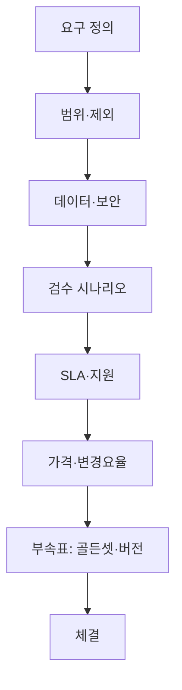

## AI 프로젝트에서 계약이 터지는 지점

전통 SI와 달리 AI 자동화는 **입력 데이터 분포가 바뀌면 출력 품질이 흔들립니다.** 그런데 계약서에는 “인공지능으로 자동화” 한 줄만 있고, **어떤 정확도·어떤 예외를 사람이 처리**하는지가 비어 있는 경우가 많습니다. 납품 후에는 “생각보다 안 됩니다”와 “요구가 늘었습니다”가 동시에 나오므로, 견적 단계에서 **범위·검수·변경**을 문장으로 고정하는 것이 비용을 가장 아낍니다.

## 범위: 자동화 경계를 동사로 쓴다

“업무를 자동화한다”는 표현은 지양하고, **입력 형식·처리 단계·출력 채널**을 나열합니다. 예: “승인된 A형 주문서 PDF만 읽어 B 시스템에 필드 C,D,E를 입력한다.” 범위 밖은 **명시적 제외**로 적습니다(수기 이미지, 스캔 품질 하한 미만, 다국어 등). 이렇게 해야 변경 요청이 왔을 때 **추가 견적**으로 자연스럽게 연결됩니다.

## 데이터·보안·준거

학습·파인튜닝·RAG에 쓰는 데이터의 **출처, 보관 기간, 삭제 요청, 재현 금지**를 분리해 둡니다. 클라우드 API를 쓰면 **전송·저장 지역, 로그 보존, 서브프로세서** 조항을 맞춥니다. 내부망만 쓰더라도 **테스트 데이터 마스킹 책임**이 어느 쪽인지 정해야 분쟁이 줄어듭니다.

## 지식재산과 산출물

프롬프트, 파이프라인 코드, 평가 스크립트, 문서 중 **누구 자산인지**를 구분합니다. 흔한 합의는 “범용 라이브러리는 공급자, 도메인 규칙·고객 데이터 기반 산출물은 고객” 형태입니다. **사전 학습 모델 가중치** 자체의 재배포 가능 여부도 라이선스에 맞춰 적습니다.

## 검수: 예시 기반 시나리오

“품질 좋게” 대신 **골든셋** 또는 합의된 테스트 세트로 통과 기준을 둡니다. 예: “표준 시나리오 N건 중 K건 이상 자동 처리, 나머지는 HITL 큐로 이관.” 재현을 위해 **버전 고정**(모델·의존성·시드)과 **평가 리포트 형식**을 부속표로 붙입니다. 모델·프롬프트가 바뀌면 **재검수 트리거**를 걸어 둡니다.

## SLA·지원·변경관리

가용성 수치만 적지 말고 **장애 등급·응답·우회 절차**를 짝지읍니다. 월간 **변경 횟수 상한** 또는 “의미 있는 성능 변화 시 사전 통지”를 넣으면 운영 리스크가 줄어듭니다. 가격은 **초기 구축·월 유지·추가 시나리오**를 분리해 두는 편이 재협상이 쉽습니다.

## 조항 체크 요약

| 영역 | 꼭 넣을 문장의 방향 |
|---|---|
| 범위 | 입력/출력/제외를 구체화 |
| 데이터 | 보관·삭제·마스킹·지역 |
| IP | 코드·규칙·문서 귀속 |
| 검수 | 시나리오·수치·재현 |
| 변경 | 재검수·한도·요율 |

### 실전 시나리오

납품 후 고객사 내부 양식이 바뀌어 **파서가 연쇄 실패**한 사례에서, 계약에 “입력 스키마 변경은 변경 요청”과 **월 N시간 포함 범위**가 있었던 쪽은 추가 비용 협의가 빨랐고, 없던 쪽은 감정 소모가 컸습니다. 기술 문제의 상당 부분은 **경계 정의 문제**로 돌아갑니다.

## 체크리스트

- 제외 범위가 **예시**까지 포함해 적혀 있는가  
- 검수 실패 시 **수정 라운드·기한**이 숫자로 있는가  
- 모델/API **버전 업 시 재검수**가 자동으로 걸리는가  
- 데이터 유출·오남용 시 **통지 기한**이 있는가  

## 마무리

AI 자동화 계약은 코드보다 먼저 **불확실성을 가격과 일정으로 바꾸는 문서**입니다. 위 항목을 한 장 체크리스트로 고객과 공유하면 견적 방어와 납품 후 운영 모두가 한결 단순해집니다.
