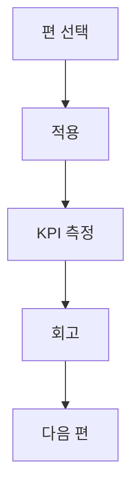

## 시리즈 목적

이 인덱스는 단순 목록이 아니라 **적용 순서와 기대 성과**를 함께 보여주는 실행 지도입니다.

## 연재 구성

| 회차 | 주제 | 링크 |
|---|---|---|
| 1편 | AI 자동화 구축형 상품화 설계 | [바로가기](/posts/ai-automation-productization-blueprint-2026/) |
| 2편 | 고객 온보딩 자동화 | [바로가기](/posts/ai-client-onboarding-automation-2026/) |
| 3편 | 프롬프트 품질 게이트 | [바로가기](/posts/prompt-quality-gate-operations-2026/) |
| 4편 | HITL 운영 매뉴얼 | [바로가기](/posts/hitl-operations-manual-2026/) |
| 5편 | 원가 구조 최적화 | [바로가기](/posts/ai-ops-cost-structure-optimization-2026/) |
| 6편 | 성과 대시보드 설계 | [바로가기](/posts/ai-ops-kpi-dashboard-design-2026/) |
| 7편 | 재구매 리포팅 자동화 | [바로가기](/posts/client-retention-reporting-automation-2026/) |
| 8편 | 확장 전략 | [바로가기](/posts/ai-automation-scale-strategy-2026/) |

## 실행 가이드

- 이번 주 적용할 편 1개를 정합니다.  
- 적용 전/후 KPI 3개를 같은 표에서 비교합니다.  
- 실패 로그를 남기고 다음 편으로 넘어갑니다.

