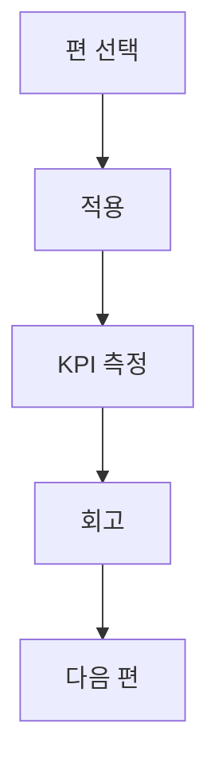

## 시리즈 목적

이 인덱스는 단순 목록이 아니라 **적용 순서와 기대 성과**를 함께 보여주는 실행 지도입니다.

## 연재 구성

| 회차 | 주제 | 링크 |
|---|---|---|
| 1편 | 홈랩 장애 알림 자동화 | [바로가기](/posts/homelab-alert-automation-2026/) |
| 2편 | 백업·복구 리허설 자동화 | [바로가기](/posts/homelab-backup-restore-drill-automation-2026/) |
| 3편 | UPS 이벤트 런북 | [바로가기](/posts/homelab-ups-event-runbook-2026/) |
| 4편 | 세그먼트별 모니터링 | [바로가기](/posts/homelab-segment-monitoring-2026/) |
| 5편 | 전력비 최적화 스케줄링 | [바로가기](/posts/homelab-power-cost-scheduling-2026/) |
| 6편 | 월간 운영 리포트 | [바로가기](/posts/homelab-monthly-ops-report-automation-2026/) |

## 실행 가이드

- 이번 주 적용할 편 1개를 정합니다.  
- 적용 전/후 KPI 3개를 같은 표에서 비교합니다.  
- 실패 로그를 남기고 다음 편으로 넘어갑니다.

