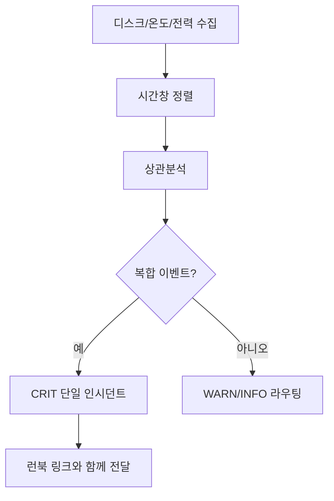

## 알림 자동화의 목표는 “더 많이 울리기”가 아니다

홈랩에서 디스크, 온도, 전력 이벤트는 서로 독립적으로 보이지만 실제로는 같은 원인에서 연쇄적으로 발생하는 경우가 많습니다. 예를 들어 냉각 문제로 온도가 오르면 디스크 대기시간이 길어지고, 결국 UPS 부하 패턴까지 흔들립니다. 이런 상황에서 이벤트를 각각 따로 알리면 운영자는 맥락을 잃습니다. 장애 알림 자동화의 핵심은 이벤트 개수를 늘리는 것이 아니라 **원인 중심으로 묶어 한 번에 판단 가능하게 만드는 것**입니다.

## 이벤트 분류 체계

| 이벤트 | 신호 | 심각도 기준 |
|---|---|---|
| 디스크 | SMART, I/O wait, 오류율 | 지속 시간과 증가율 |
| 온도 | CPU/NAS/실내 온도 | 임계 초과 지속 여부 |
| 전력 | UPS 부하율, 배터리 상태 | 잔여 시간 기반 |
| 복합 | 다중 이벤트 동시 발생 | 즉시 페이지 |

## 상관분석과 집계 규칙

알림 피로를 줄이려면 같은 시간창에서 발생한 이벤트를 상관분석해 단일 인시던트 키로 묶어야 합니다. 예를 들어 5분 이내에 “온도 상승 + 디스크 대기 급증 + UPS 부하 급변”이 같이 잡히면 개별 경고 3건 대신 `CRIT: thermal-power-disk-chain` 1건으로 보냅니다. 반대로 단일 신호만 있을 때는 경고 수준으로 남겨 노이즈를 줄입니다. 운영자는 건수보다 **맥락이 붙은 사건**을 더 빠르게 처리합니다.

## KPI 설계

| KPI | 정의 | 목표 |
|---|---|---|
| 의미 있는 알람 비율 | 실제 조치로 이어진 알람 비율 | 상승 |
| 중복 알람률 | 같은 원인의 중복 발행 비율 | 감소 |
| 탐지 지연 | 이상 발생~첫 알람까지 시간 | 단축 |
| MTTR | 감지~복구 완료 시간 | 전월 대비 개선 |

### 실전 시나리오

여름철 야간에 온도 경고와 디스크 경고가 번갈아 울려 담당자가 원인을 놓친 사례에서, 상관분석 규칙을 추가해 복합 이벤트를 단일 인시던트로 집계하자 대응 절차가 단순해졌습니다. 이후에는 “냉각 경로 점검” 런북으로 바로 연결되어 MTTR이 짧아졌고, 불필요한 디스크 교체 시도도 줄었습니다.

## 체크리스트

- 이벤트 시간창과 집계 키가 문서화되어 있는가  
- 심각도별 채널 분리 기준이 고정되어 있는가  
- 모든 CRIT 알림에 런북 링크가 포함되는가  
- 월간 회고에서 중복 알람률을 추적하는가  

## 마무리

장애 알림 자동화는 결국 신호의 품질을 높이는 작업입니다. 디스크·온도·전력 이벤트를 맥락 중심으로 묶으면, 홈랩 규모에서도 대응 속도와 정확도를 동시에 끌어올릴 수 있습니다.

## 참고문헌

- [Google SRE Book - Monitoring Distributed Systems](https://sre.google/sre-book/monitoring-distributed-systems/)
- [Prometheus Alerting Rules](https://prometheus.io/docs/prometheus/latest/configuration/alerting_rules/)
- [OpenTelemetry Concepts](https://opentelemetry.io/docs/concepts/)
