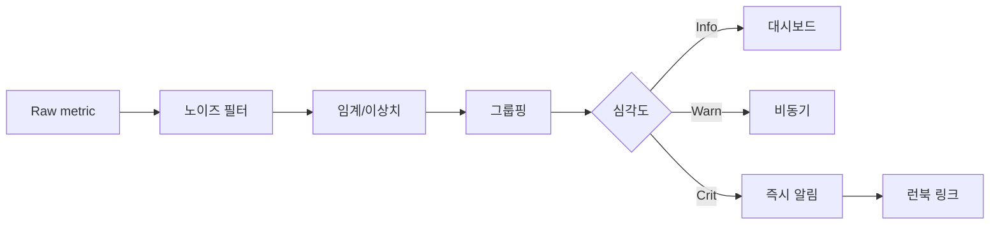

## 알람 피로가 생기는 구조적 이유

알람이 많다고 해서 **관측이 잘되는 것**은 아닙니다. 동일 원인에 대해 CPU·메모리·디스크·서비스 프로브가 **각각 따로 울리면** 사람은 패턴을 읽기 전에 채널을 끕니다. 홈랩에서는 “테스트용 임계값을 프로덕션급으로 두었다”거나, **유지보수 창** 없이 밤마다 백업 I/O로 디스크 경고가 나는 식의 **환경 특성 미반영**도 흔합니다. 목표는 알람 수가 아니라 **조치로 이어지는 신호 비율**을 올리는 것입니다.

## 한 가지 사건 = 한 알람(집계)

같은 장애의 1차·2차 증상을 **하나의 인시던트**로 묶습니다. 예를 들어 디스크 지연으로 서비스 타임아웃이 났다면, “디스크”와 “HTTP 5xx”를 **동일 그룹**에서 짧은 시간 창 안에 합쳐 상위 1건만 페이지합니다. Prometheus라면 `group_wait`/`group_interval`, 다른 스택이라면 이벤트 버스에서 **디듑 윈도**를 둡니다. 집계 규칙이 없으면 피로도는 기술로 해결되지 않습니다.

## 심각도와 채널 분리

**Info**는 로그·대시보드, **Warning**은 비동기 채널(메일·스레드), **Critical**만 즉시 알림으로 보냅니다. 홈랩이라도 “전부 카톡”이면 곧 무력화됩니다. 심각도 정의는 **사용자 영향** 기준으로 문장화합니다. 예: “외부에서 핵심 서비스 접속 불가 가능”은 Critical, “디스크 사용률 80%”는 Warning 등. 정의가 없으면 규칙 추가할 때마다 기준이 흔들립니다.

## 임계값은 기준선에서

정적 임계값은 **계절·배포·백업 스케줄**에 밀립니다. 가능하면 최근 2~4주 **백분위**나 이동 평균 대비 편차로 잡고, 급격한 변화율(derivative)을 보조 신호로 씁니다. 당장 어렵다면 최소한 **유지보수 중 억제(silence)** 를 표준화해 야간 백업 구간의 거짓 긴급을 막습니다.

## 설계 점검표

| 항목 | 나쁜 예 | 좋은 예 |
|---|---|---|
| 채널 | 모든 심각도 동일 | 심각도별 라우팅 |
| 중복 | 동일 원인 N건 | 시간창 집계 |
| 임계값 | 고정 90% | 기준선·윈도 |
| 소음 | 영구 무시 | 침묵 기간·원인 추적 |

### 실전 시나리오

스마트플러그 전력 모니터가 **짧은 스파이크**마다 경고를 보내 채널이 마비된 경우, 해결은 임계값 변경이 아니라 **평활화(rolling avg)** 와 **최소 지속 시간** 조건을 추가하고, 같은 장치에서 오는 알림을 **5분 윈도 1건**으로 제한한 것이었습니다. “민감하게” 두는 것이 항상 좋은 것은 아닙니다.

## 체크리스트

- 각 알람에 **런북 URL 또는 한 줄 조치**가 붙는가  
- 유지보수·백업 구간 **억제 정책**이 있는가  
- 지난 달 알람 중 **조치 없이 닫힌 비율**을 셀 수 있는가  
- 새 규칙 추가 시 **심각도 정의 문서**를 갱신하는가  

## 마무리

알람 피로는 개인의 인내력 문제가 아니라 **라우팅·집계·임계값 설계** 문제입니다. 홈랩이라도 이 세 가지만 정리하면 같은 장비로 훨씬 조용하고 신뢰할 만한 관측이 됩니다.
