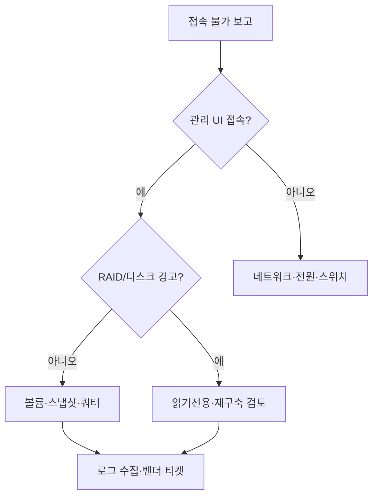

## NAS 장애에서 먼저 망가지는 것

NAS는 “디스크 한 장”보다 **메타데이터·공유 프로토콜·네트워크 경로**가 먼저 문제를 일으키는 경우가 많습니다. 사용자 입장에서는 “폴더가 안 열린다”로 보이지만, 실제로는 SMB 세션 폭주, DNS 역조회 지연, 스냅샷 공간 부족으로 쓰기가 멈춘 경우가 섞여 있습니다. 그래서 첫 10분은 **증상 분류**에 쓰고, 바로 디스크 교체부터 하지 않는 것이 오탐을 줄이는 지름길입니다.

## 1단계: 가용성 vs 데이터 무결성

관리 콘솔에 **디스크/RAID 경고**가 떴다면, 우선 “읽기 전용으로 전환할 수 있는가”를 확인합니다. 쓰기를 계속 허용하면 재구축 중 추가 손상 위험이 커질 수 있습니다. 반대로 **네트워크만 끊긴 것**이라면 스위치·케이블·LAG 설정·방화벽 규칙을 먼저 본 뒤 스토리지 쪽으로 내려갑니다. 이 분기를 문서에 박아 두면 야간 대응 시 판단이 빨라집니다.

## 2단계: 볼륨·스냅샷·쿼터

I/O 지연은 **스냅샷 예약이 겹치거나**, **쿼터/할당량**에 걸린 경우가 흔합니다. DSM·QTS 등 제조사별 화면은 다르지만 공통으로 볼 것은 사용량 추이, 스냅샷 보존 정책, SSD 캐시 오류입니다. 스냅샷이 수백 개 쌓인 홈랩이라면 **보존 주기를 먼저 줄이고** 디스크를 의심하는 순서가 비용 대비 효과가 좋은 경우가 많습니다.

## 3단계: 복구와 커뮤니케이션

RAID 재구축은 **동일 용량·동일 RPM급**으로 맞추고, 가능하면 벤더 권장 펌웨어로 통일합니다. 복구 중에는 내부 사용자에게 **예상 다운타임·읽기 전용 전환**을 짧게 공지하고, 백업 쪽 RTO와 연동해 “NAS 복구 실패 시 복원 경로”를 미리 적어 둡니다. 로그는 **타임스탬프·이벤트 코드**까지 남겨 나중에 벤더 티켓에 붙일 수 있게 합니다.

## 분기 요약표

| 신호 | 우선 의심 | 1차 조치 |
|---|---|---|
| 공유만 안 됨 | 네트워크·DNS·방화벽 | ping, 포트, 세션 수 |
| 느려짐 | 스냅샷·쿼터·캐시 | IO 대기·용량·스케줄 |
| 디스크 경고 | 물리·RAID | 읽기 전용·핫스페어 |
| 체크섬 오류 | 파일시스템 | 스크럽·벤더 가이드 |

### 실전 시나리오

야간에 **백업 에이전트가 동시에 풀 스캔**을 돌리면서 NAS CPU가 포화되어 SMB 타임아웃이 난 사례입니다. 디스크는 정상이었고, 백업 창을 분산하고 **동시 연결 수 제한**을 조정한 뒤 증상이 사라졌습니다. “스토리지 장애”라고 이름 붙이기 전에 **부하 패턴**을 보는 것이 핵심입니다.

## 체크리스트

- 관리 IP·비상 계정·2FA 복구 경로가 최신인가  
- RAID 구성·디스크 모델·펌웨어 버전이 문서와 일치하는가  
- 스냅샷 보존이 백업 RPO와 **중복되지 않는가**  
- NAS 복구 실패 시 **대체 읽기 경로**(읽기 전용 복제 등)가 있는가  

## 마무리

NAS 매뉴얼의 목적은 **모든 경우의 수를 외우는 것**이 아니라, 밤에 머리가 멈췄을 때도 **올바른 순서로 의심 목록을 타고 내려가게 하는 것**입니다. 분기표와 로그 템플릿만 있어도 MTTR은 눈에 띄게 줄어듭니다.
