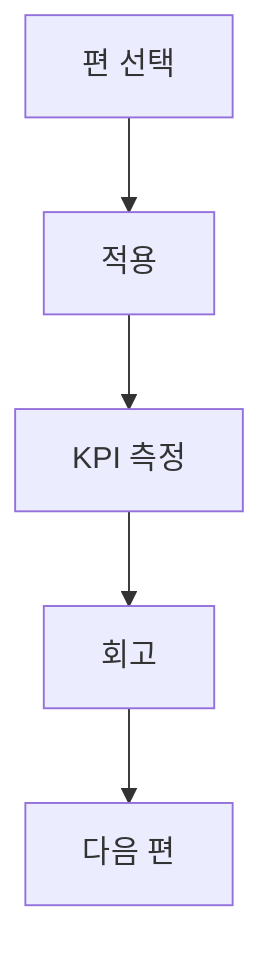

## 시리즈 목적

이 인덱스는 단순 목록이 아니라 **적용 순서와 기대 성과**를 함께 보여주는 실행 지도입니다.

## 연재 구성

| 회차 | 주제 | 링크 |
|---|---|---|
| 1편 | 키워드 클러스터링 | [바로가기](/posts/seo-keyword-clustering-topic-map-2026/) |
| 2편 | 글 구조 템플릿 자동 생성 | [바로가기](/posts/content-structure-template-automation-2026/) |
| 3편 | SVG 파이프라인 | [바로가기](/posts/svg-pipeline-automation-2026/) |
| 4편 | 내부 링크 자동 반영 | [바로가기](/posts/internal-link-series-index-automation-2026/) |
| 5편 | 리프레시 캘린더 | [바로가기](/posts/content-refresh-calendar-operations-2026/) |
| 6편 | 성과 분석 루프 | [바로가기](/posts/seo-content-performance-loop-2026/) |

## 실행 가이드

- 이번 주 적용할 편 1개를 정합니다.  
- 적용 전/후 KPI 3개를 같은 표에서 비교합니다.  
- 실패 로그를 남기고 다음 편으로 넘어갑니다.

