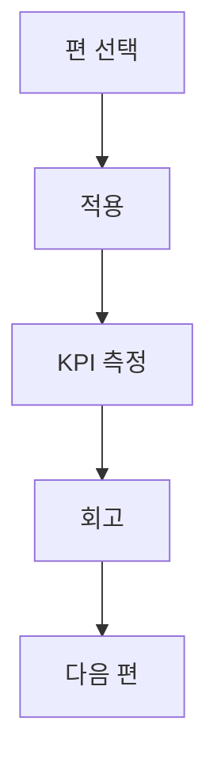

## 시리즈 목적

이 인덱스는 단순 목록이 아니라 **적용 순서와 기대 성과**를 함께 보여주는 실행 지도입니다.

## 연재 구성

| 회차 | 주제 | 링크 |
|---|---|---|
| 1편 | 30일 첫 매출 플랜 | [바로가기](/posts/ai-automation-first-revenue-30days-2026/) |
| 2편 | 니치 선정 프레임워크 | [바로가기](/posts/niche-selection-framework-ai-2026/) |
| 3편 | 제안서 자동화 | [바로가기](/posts/proposal-automation-template-2026/) |
| 4편 | 납품 QA 체계 | [바로가기](/posts/delivery-qa-framework-ai-services-2026/) |
| 5편 | 월 1000만원 모델 | [바로가기](/posts/monthly-10m-krw-ai-ops-model-2026/) |

## 실행 가이드

- 이번 주 적용할 편 1개를 정합니다.  
- 적용 전/후 KPI 3개를 같은 표에서 비교합니다.  
- 실패 로그를 남기고 다음 편으로 넘어갑니다.

