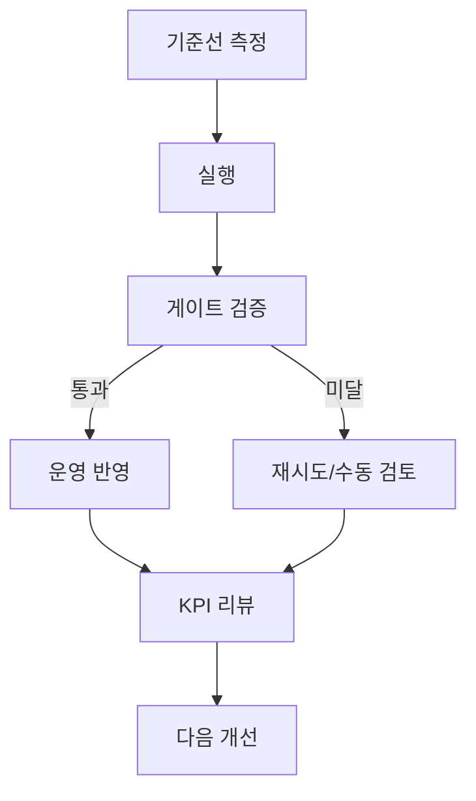

## 왜 이 문서가 중요한가

이 문서는 정보 요약보다 **실행 가능한 운영 규칙**을 만드는 데 초점을 둡니다. 실제 운영에서 가장 자주 깨지는 지점을 먼저 고정하면, 품질과 속도, 비용을 함께 개선할 수 있습니다.

## 핵심 운영 설계

| 항목 | 질문 | 기준 |
|---|---|---|
| 범위 | 어디까지 납품인가 | 포함/제외 문장 고정 |
| 가격 | 왜 이 단가인가 | 변동비+검수비 분리 |
| 품질 | 통과 기준은 무엇인가 | 수치+예시 이중 검증 |
| 재구매 | 다음 계약 근거가 있는가 | 전/후 KPI 리포트 |

## KPI 대시보드 기준

| KPI | 정의 | 목표 |
|---|---|---|
| 파일럿 전환율 | 제안 대비 유료 전환 | 30% 이상 |
| 1회 통과율 | 수정 없이 승인된 비율 | 75% 이상 |
| 고객당 공헌이익 | 객단가-변동비 | 전월 대비 증가 |
| 재구매율 | 60일 내 추가 계약 | 증가 추세 |

## 실행 절차

1. **기준선 확보**: 최근 2~4주 지표를 기준값으로 고정합니다.  
2. **변경점 1개 적용**: 한 번에 하나만 바꿔 인과를 확인합니다.  
3. **게이트 검증**: 하한 미달 시 롤백 또는 수동 검토로 전환합니다.  
4. **로그 코드화**: 실패 사유를 코드로 남겨 회고에 반영합니다.  
5. **주간 회고**: 개선 과제 3개만 다음 스프린트에 올립니다.

### 실전 시나리오

- **상황**: 납품 후 수정 요청이 급증  
- **원인**: 승인 기준과 범위 문장이 모호함  
- **조치**: 반려 사유 코드화 + 승인표 계약서 별첨  
- **결과**: 재작업률 2주 내 유의미 감소

## 체크리스트

- 기준·책임자·마감이 한 문서에서 확인되는가  
- KPI가 행동으로 연결되는가  
- 실패 로그가 다음 백로그로 넘어가는가  
- 자동화 범위가 팀 역량 대비 과도하지 않은가

## 마무리

핵심은 기술이 아니라 **운영 리듬**입니다. 기준-실행-검증-개선을 끊기지 않게 반복하면, 작은 팀도 안정적으로 성과를 축적할 수 있습니다.
