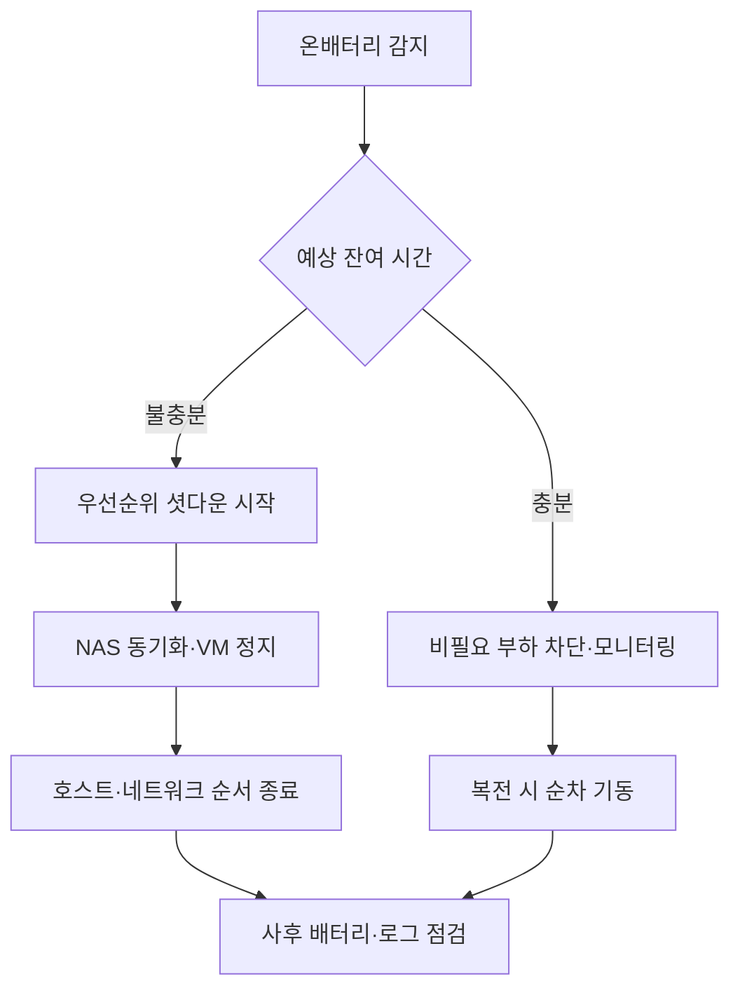

## 전력 이벤트는 “길이”가 전부

순간 낙뢰·서지와 **수 분~수 시간 정전**은 대응이 완전히 다릅니다. 전자는 서지 보호·차단기·접지 품질이 핵심이고, 후자는 **UPS 예상 런타임**과 **우아한 종료 순서**가 핵심입니다. 홈랩에서는 NAS·라우터·미니 PC의 소비 전력을 합산해 **실측 런타임**을 분기마다 다시 적는 것만으로도 과신을 줄일 수 있습니다. 스펙 시트의 분 수치는 부하율에 따라 급격히 줄어듭니다.

## 이벤트 A: 온배터리 전환

UPS가 **온배터리(beep)** 로 들어가면 즉시 확인할 것은 남은 시간 추정치와 **어떤 콘센트가 UPS에 물려 있는지**입니다. 모니터·스피커처럼 필수가 아닌 부하는 먼저 끕니다. NUT·네트워크 관리 카드가 있다면 **NAS와 하이퍼바이저에 셧다운 신호**가 실제로 도달하는지 테스트해 둡니다. “UPS만 살고 서버는 하드 오프”가 되면 런북이 아무 의미가 없습니다.

## 이벤트 B: 런타임 부족

예상 시간이 **안전 마진(예: 30%)** 아래로 떨어지면, 우선순위에 따라 서비스를 내립니다. 예: (1) 실험용 VM 전원, (2) 백업이 끝난 보조 NAS, (3) 코어 라우터는 최후까지. 순서는 **데이터 손실 위험**이 낮은 것부터이며, 문서에 고정해 두어야 야간에 논쟁하지 않습니다. 가능하면 **저전력 모드**(디스크 스핀다운 비활성화 주의)로 버티는 옵션도 같이 적습니다.

## 이벤트 C: 배터리 교체·펌웨어

주기적 **자체 테스트**에서 런타임이 급감했다면 교체 시기입니다. 홈랩은 종종 “UPS는 있는데 배터리는 3년째” 패턴이므로, 캘린더 알림을 **제조사 권장 주기보다 짧게** 잡는 편이 안전합니다. 교체 후에는 **부하를 걸고 재측정**해 런북의 분 수를 업데이트합니다. 펌웨어는 릴리스 노트에 **셧다운 타이밍 변경**이 있는지 확인 후 적용합니다.

## 런타임·역할 표

| 구성요소 | 전력(예시) | 셧다운 순서 메모 |
|---|---|---|
| 코어 스위치 | 낮음 | 후순위 |
| 라우터/방화벽 | 중간 | 중간 |
| NAS | 높음 | 먼저 동기화 후 신호 |
| 가상화 호스트 | 높음 | VM 정지 후 호스트 |

### 실전 시나리오

짧은 정전이 잦은 지역에서 **NAS만 UPS에 연결**하고 스위치는 보호 없이 두어, 복전 직후 NAS는 살아 있으나 **네트워크가 순간 리셋**되어 마운트가 깨진 사례가 있었습니다. 해결은 코어 스위치까지 **동일 UPS 그룹**에 넣거나, 최소한 스위치용 소형 UPS를 추가하는 것이었습니다. 전력은 **경로 전체**로 설계해야 합니다.

## 체크리스트

- NUT/에이전트가 **방화벽 뒤에서도** 통신하는가  
- 셧다운 스크립트가 최신 OS에서 **권한·경로**가 유효한가  
- 런타임 수치가 **실측**으로 문서에 있는가  
- 배터리 교체일·다음 점검일이 캘린더에 있는가  

## 마무리

UPS 런북은 장비 설명서가 아니라 **시간이 줄어들 때 무엇을 끄는지**에 대한 합의 문서입니다. 한 번 실제로 드릴을 하면, 추정치와 현실의 차이를 숫자로 고칠 수 있고 그게 곧 다음 사고의 여유 시간이 됩니다.
