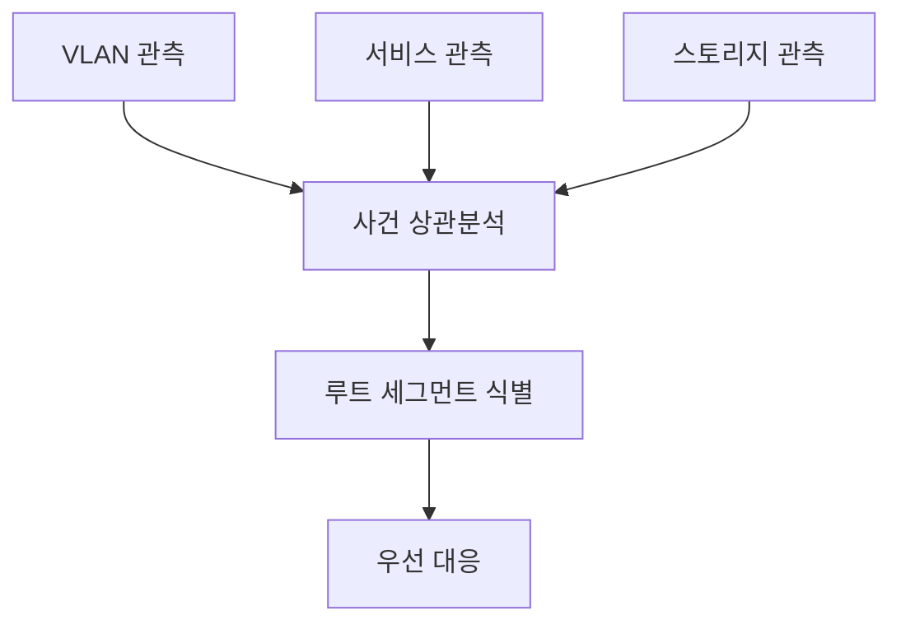

## 세그먼트 관측이 필요한 이유

홈랩에서 “느리다”는 신고가 들어오면 원인이 네트워크, 애플리케이션, 스토리지 중 어디인지 즉시 판단하기 어렵습니다. 이때 전체 평균 지표만 보면 문제를 놓치기 쉽습니다. 세그먼트별 모니터링은 VLAN 구간, 서비스 계층, 스토리지 계층을 분리해 관측함으로써 **장애 범위를 먼저 좁히는 전략**입니다. 진단 시간이 줄어들면 복구 시간도 함께 줄고, 불필요한 장비 교체도 예방할 수 있습니다.

## 관측 계층 설계

| 계층 | 주요 지표 | 1차 판단 |
|---|---|---|
| VLAN/네트워크 | 지연, 손실, 재전송, ARP 이상 | 경로 문제 여부 |
| 서비스 | 응답시간, 5xx, 큐 길이 | 앱/프로세스 병목 |
| 스토리지 | IOPS, 대기시간, 디스크 오류 | 데이터 계층 병목 |
| 제어평면 | DNS, NTP, 인증 | 공통 기반 이상 |

## 알람 라우팅 설계

세그먼트 관측의 효과는 알람 체계에서 결정됩니다. 같은 장애라도 네트워크와 서비스가 동시에 경고를 내면 담당자는 혼란스럽습니다. 따라서 상위 사건 키를 만들어 “루트 세그먼트”를 우선 표시해야 합니다. 예를 들어 VLAN 패킷 손실이 기준치를 넘으면, 해당 시간대 서비스 경고는 보조 신호로 표시하고 네트워크 사건에 종속시킵니다. 이렇게 하면 페이지 1건으로 시작해 조사 범위를 좁힐 수 있습니다.

## KPI 설계

| KPI | 정의 | 목표 |
|---|---|---|
| 진단 시작 시간 | 첫 알람 후 원인 세그먼트 식별까지 | 단축 |
| 잘못된 에스컬레이션 | 다른 계층으로 잘못 전파한 비율 | 감소 |
| 세그먼트별 가용성 | 계층별 SLA/가용성 | 기준 충족 |
| 관측 공백 시간 | 메트릭 수집 누락 시간 | 최소화 |

### 실전 시나리오

사용자는 “웹이 느리다”고 보고했지만 CPU 사용률은 정상이던 사례가 있었습니다. 세그먼트 관측을 켜보니 특정 VLAN 구간에서만 패킷 손실이 급증했고, 원인은 스위치 포트 협상 오류였습니다. 만약 서비스 지표만 봤다면 앱 튜닝으로 시간을 낭비했을 가능성이 큽니다. 계층 분리를 해두면 원인 추적의 첫 단추를 훨씬 빠르게 끼울 수 있습니다.

## 체크리스트

- VLAN/서비스/스토리지 지표가 분리 수집되는가  
- 알람 메시지에 세그먼트 태그가 포함되는가  
- 공통 기반(DNS/NTP) 지표가 별도 추적되는가  
- 월간 회고에서 세그먼트별 장애 비중을 분석하는가  

## 마무리

세그먼트 모니터링은 지표를 늘리는 작업이 아니라, 원인 탐색 경로를 짧게 만드는 작업입니다. 홈랩 규모에서도 계층 분리만 제대로 해두면 장애 대응의 일관성과 속도가 눈에 띄게 개선됩니다.

## 참고문헌

- [Cisco - VLAN Configuration Guide](https://www.cisco.com/c/en/us/support/docs/lan-switching/vlan/10023-3.html)
- [Prometheus - Best Practices](https://prometheus.io/docs/practices/naming/)
- [Google SRE - Monitoring and Alerting](https://sre.google/sre-book/monitoring-distributed-systems/)
