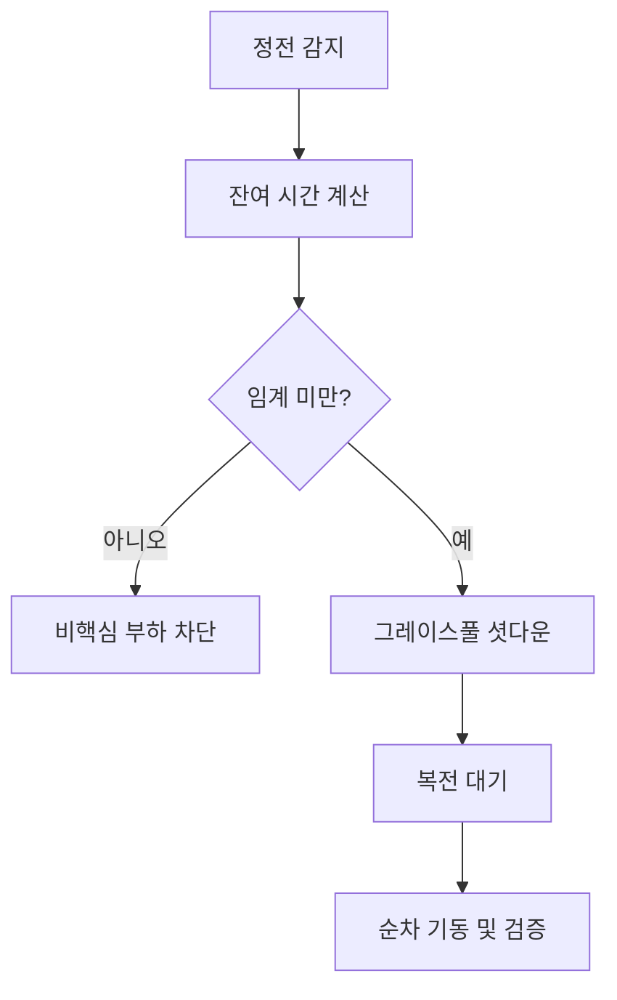

## UPS 런북이 필요한 이유

정전이 발생했을 때 가장 위험한 순간은 전원이 나가는 시점이 아니라, 배터리가 거의 바닥난 상태에서 장비가 무질서하게 꺼지는 시점입니다. 데이터 손상, 파일시스템 불일치, VM 강제 종료가 이때 집중됩니다. UPS 런북은 “어떤 순서로 무엇을 끌 것인지”를 미리 문서화해, 긴장된 상황에서도 같은 행동이 나오도록 만드는 장치입니다.

## 이벤트 단계와 대응

| 단계 | 트리거 | 핵심 행동 |
|---|---|---|
| 전환 감지 | 상용 전원 손실 | 운영 채널 공지, 모니터링 강화 |
| 배터리 운전 | 예상 시간 감소 | 비핵심 서비스 중단 |
| 임계 도달 | 잔여 시간 하한 도달 | 그레이스풀 셧다운 시작 |
| 복전 후 | 상용 전원 복구 | 순차 기동, 무결성 점검 |

## 그레이스풀 셧다운 순서

권장 순서는 일반적으로 `배치 작업 중단 → 애플리케이션 쓰기 정지 → 데이터 동기화 확인 → VM 종료 → NAS/스토리지 정리 종료 → 네트워크 코어 장비 유지`입니다. 코어 네트워크를 가장 먼저 내려버리면 원격 제어가 끊겨 나머지 장비를 정상 종료할 기회를 잃습니다. 따라서 장비별 종료 우선순위를 표로 만들고, 분기별로 실제 드릴을 돌려 타이밍을 보정해야 합니다.

## 핵심 지표

| 지표 | 정의 | 목표 |
|---|---|---|
| 셧다운 성공률 | 계획 순서대로 종료된 비율 | 100% 지향 |
| 데이터 무결성 이슈 | 복전 후 fsck/DB 오류 건수 | 0건 |
| 복구 준비 시간 | 복전 후 정상화까지 시간 | 단축 |
| 배터리 상태 정확도 | 예측 대비 실제 런타임 오차 | 축소 |

### 실전 시나리오

정전 시 라우터부터 꺼지도록 설정된 홈랩에서는 원격 접속이 즉시 끊겨 NAS 종료 신호를 못 보내는 문제가 반복됐습니다. 종료 순서를 반대로 바꿔 NAS와 VM을 먼저 안전 종료하고 라우터를 마지막으로 유지하도록 변경한 뒤, 데이터 손상 사례가 사라졌습니다. 런북의 핵심은 복잡한 기술이 아니라 **순서의 일관성**입니다.

## 체크리스트

- 장비별 종료 우선순위와 예상 시간이 문서화되어 있는가  
- UPS 배터리 교체 주기와 테스트 일정이 기록되어 있는가  
- 복전 후 점검 항목(DB, 파일시스템, 네트워크)이 정해져 있는가  
- 분기별 드릴 결과가 다음 런북 개정에 반영되는가  

## 마무리

UPS 런북은 비상 상황에서 팀의 판단 부담을 줄이는 보험입니다. 한 번 잘 써두면 정전이 와도 당황 대신 절차가 먼저 움직이게 만들 수 있습니다.

## 참고문헌

- [APC - UPS Runtime and Sizing Basics](https://www.apc.com/us/en/faqs/FA156579/)
- [Network UPS Tools (NUT) - User Manual](https://networkupstools.org/docs/user-manual.chunked/)
- [systemd - systemd-poweroff.service](https://www.freedesktop.org/software/systemd/man/systemd-poweroff.service.html)
