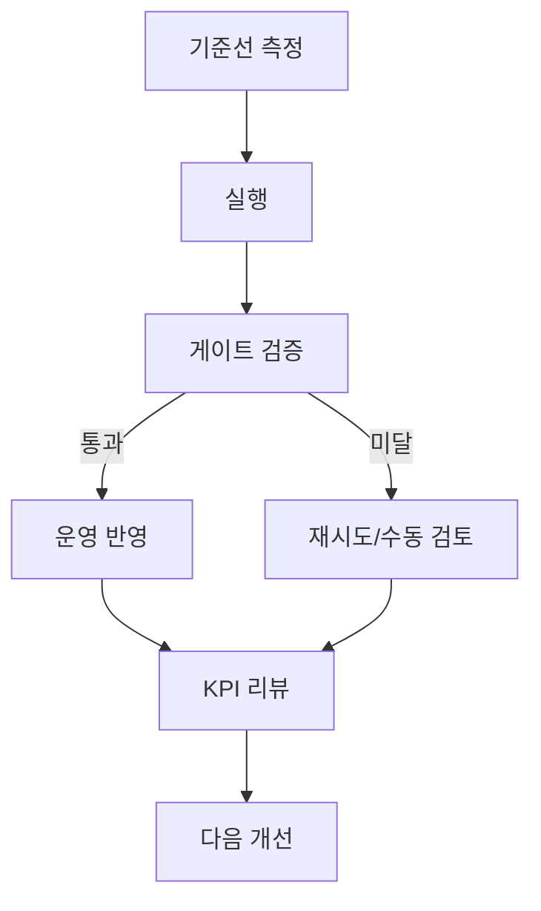

## 왜 이 문서가 중요한가

이 문서는 정보 요약보다 **실행 가능한 운영 규칙**을 만드는 데 초점을 둡니다. 실제 운영에서 가장 자주 깨지는 지점을 먼저 고정하면, 품질과 속도, 비용을 함께 개선할 수 있습니다.

## 핵심 운영 설계

| 레이어 | 핵심 작업 | 실패 패턴 |
|---|---|---|
| 토픽맵 | 클러스터/의도 분류 | 주제 중복 |
| 작성 템플릿 | 제목-표-다이어그램 표준화 | 품질 편차 |
| 내부 링크 | 허브/시리즈 자동 연결 | 고립 문서 증가 |
| 리프레시 | 갱신 캘린더 운영 | 상위 문서 노후화 |

## KPI 대시보드 기준

| KPI | 정의 | 목표 |
|---|---|---|
| 클러스터 커버율 | 계획 대비 발행 비율 | 85% 이상 |
| 내부링크 밀도 | 문서당 유효 내부링크 | 증가 추세 |
| 리프레시 준수율 | 예정 문서 갱신 완료 | 90% 이상 |
| 유입 품질 | CTR·체류·전환 | 동시 개선 |

## 실행 절차

1. **기준선 확보**: 최근 2~4주 지표를 기준값으로 고정합니다.  
2. **변경점 1개 적용**: 한 번에 하나만 바꿔 인과를 확인합니다.  
3. **게이트 검증**: 하한 미달 시 롤백 또는 수동 검토로 전환합니다.  
4. **로그 코드화**: 실패 사유를 코드로 남겨 회고에 반영합니다.  
5. **주간 회고**: 개선 과제 3개만 다음 스프린트에 올립니다.

### 실전 시나리오

- **상황**: 검색 유입은 증가했지만 전환 정체  
- **원인**: 정보형 문서 편중, 결정형 콘텐츠 부족  
- **조치**: 비교표/체크리스트/CTA 포함 문서 보강  
- **결과**: 4주 후 문의 전환율 상승

## 체크리스트

- 기준·책임자·마감이 한 문서에서 확인되는가  
- KPI가 행동으로 연결되는가  
- 실패 로그가 다음 백로그로 넘어가는가  
- 자동화 범위가 팀 역량 대비 과도하지 않은가

## 마무리

핵심은 기술이 아니라 **운영 리듬**입니다. 기준-실행-검증-개선을 끊기지 않게 반복하면, 작은 팀도 안정적으로 성과를 축적할 수 있습니다.
