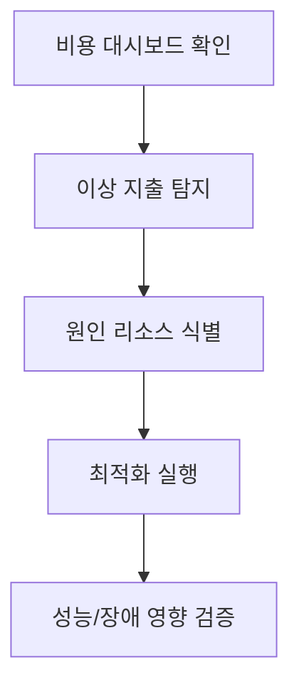

## 비용 최적화 우선순위

| 우선순위 | 작업 | 기대 효과 |
|---|---|---|
| 1 | 미사용 리소스 제거 | 즉시 비용 절감 |
| 2 | 과대 스펙 다운사이징 | 월간 고정비 절감 |
| 3 | 스토리지 수명주기 정책 | 장기 보관 비용 절감 |
| 4 | 예약/절감 플랜 적용 | 예측 가능 비용 구조 |

## 결론

비용 최적화는 절감 프로젝트가 아니라 지속 운영 체계입니다.

