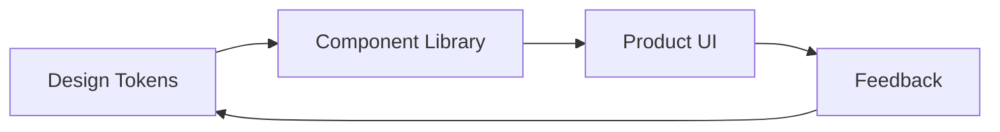

## 핵심 구성 요소

| 구성 | 설명 |
|---|---|
| 디자인 토큰 | 색상, 타이포, 간격의 공통 언어 |
| UI 컴포넌트 | 재사용 가능한 화면 구성 단위 |
| 문서/가이드 | 사용 기준과 예외 정책 |
| 거버넌스 | 변경 승인과 릴리스 규칙 |

```mermaid
flowchart LR
    A[Design Tokens] --> B[Component Library]
    B --> C[Product UI]
    C --> D[Feedback]
    D --> A
```

## 결론

디자인 시스템은 라이브러리가 아니라 팀의 합의 시스템입니다.

