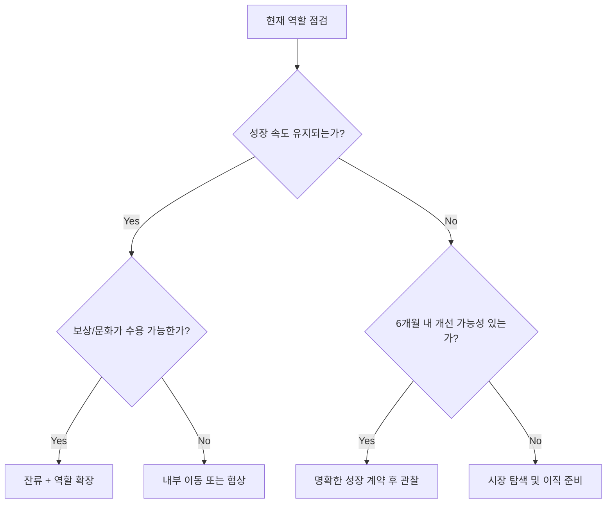

커리어는 연차가 아니라 "문제 난이도와 영향 범위"로 성장합니다.  
같은 5년 차라도 어떤 사람은 기능 구현자에 머물고, 어떤 사람은 팀의 의사결정을 주도합니다.

## 성장의 4개 축

| 축 | 주니어 | 미들 | 시니어/리드 |
|---|---|---|---|
| 기술 깊이 | 기능 구현 중심 | 성능/품질 개선 | 아키텍처/표준 정의 |
| 문제 해결 | 주어진 이슈 처리 | 문제 재정의 가능 | 문제 자체를 발견하고 제거 |
| 협업 영향력 | 개인 기여 | 리뷰/멘토링 | 팀 간 조율/우선순위 결정 |
| 비즈니스 이해 | 요구사항 수용 | 지표 연결 | 전략과 실행 연결 |

## 연차별 핵심 과제

### 0~2년: 실행력과 기본기

- 디버깅, 테스트, 코드리뷰 응답 속도  
- 작은 기능을 끝까지 배포하는 경험  
- 실수 기록과 회고 습관

### 3~5년: 시스템 관점 확장

- 장애 원인 분석과 재발 방지  
- 기능보다 구조 개선의 우선순위 판단  
- 팀 생산성을 높이는 자동화

### 6년+: 영향력 설계

- 기술 의사결정 문서화  
- 팀 목표와 개인 목표 정렬  
- 채용/온보딩/문화 기여

## 의사결정 흐름: 이직 vs 잔류

## 포트폴리오 설계 원칙

| 요소 | 나쁜 예 | 좋은 예 |
|---|---|---|
| 프로젝트 설명 | "백엔드 개발함" | "응답시간 40% 단축, 장애율 30% 감소" |
| 역할 정의 | "팀원으로 참여" | "요구사항 분석, API 설계, 배포 자동화 리드" |
| 학습 기록 | 기술 나열 | 문제-가설-실험-결과 구조 |
| 협업 증거 | 없음 | 리뷰 코멘트, ADR, RFC 링크 |

## 성과 평가 시즌 전략

1. 분기 초에 목표를 "지표 언어"로 합의  
2. 월간으로 결과물을 축적(문서/PR/리뷰)  
3. 평가 직전에 요약하지 말고, 항상 업데이트  
4. 정량 + 정성(영향력 사례) 함께 준비

## 커리어 리스크 관리

| 리스크 | 초기 신호 | 대응 |
|---|---|---|
| 기술 정체 | 같은 업무 반복 | 분기별 학습 주제 고정 |
| 번아웃 | 집중력 저하, 냉소 증가 | 업무 강도 조정, 회복 루틴 |
| 시장 불일치 | 기술 수요 감소 | 도메인/플랫폼 확장 |
| 가시성 부족 | 성과가 인지되지 않음 | 문서화/공유 루틴 강화 |

## 분기 실행 체크리스트

- [ ] 내 업무가 회사 핵심 지표와 연결되는가  
- [ ] 지난 3개월의 성장 증거를 문서로 제시 가능한가  
- [ ] 기술·협업·비즈니스 3축에서 모두 개선이 있었는가  
- [ ] 다음 분기 목표가 구체적인가(측정 가능)  
- [ ] 멘토/동료에게 피드백을 정기적으로 받는가

## 결론

커리어 성장은 우연히 오지 않습니다.  
연차별 핵심 과제를 명확히 두고, 성과를 기록 가능한 형태로 남기면 이직이든 승진이든 선택지가 넓어집니다.

