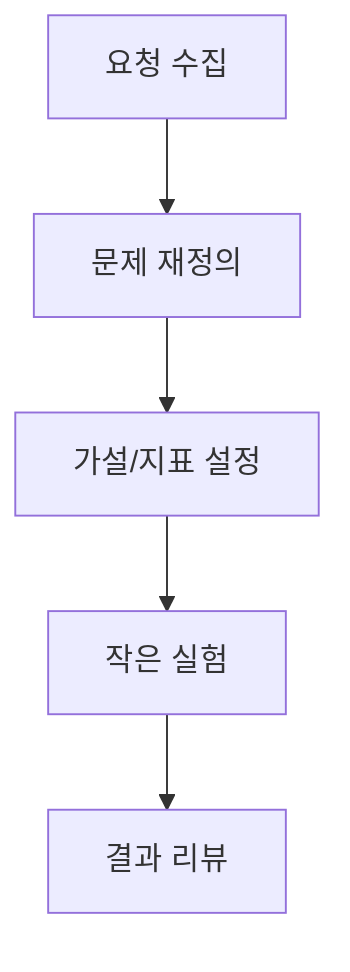

좋은 제품관리는 요청을 많이 받는 능력이 아니라, 무엇을 지금 하지 않을지 명확히 정하는 능력입니다.

## 문제 정의 템플릿

| 항목 | 질문 |
|---|---|
| 대상 사용자 | 누구의 어떤 불편을 줄일 것인가 |
| 성공 지표 | 무엇이 개선되면 성공인가 |
| 제약 조건 | 시간/기술/법무 제약은 무엇인가 |
| 실험 방법 | 가장 작은 검증 단위는 무엇인가 |

## 결론

개발자 친화 PM의 핵심은 요구사항 문서가 아니라 실험 가능한 단위로 쪼개는 구조입니다.

