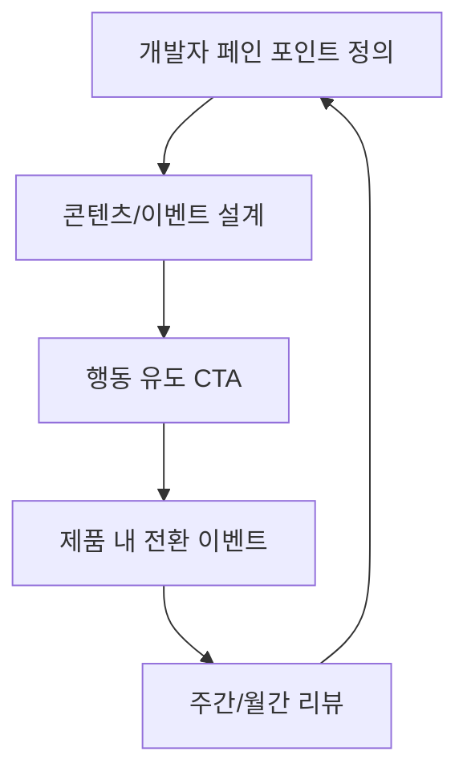

DevRel은 인기 투표가 아니라 **개발자가 제품 가치를 실제로 체감하도록 만드는 시스템**입니다.  
행사와 블로그만 늘리면 활동량은 늘지만, 제품 지표와의 연결이 끊기기 쉽습니다.

## 프로그램 3축

| 축 | 역할 | 대표 산출물 |
|---|---|---|
| Education | 온보딩·레퍼런스·튜토리얼 | 문서, 샘플, 워크숍 |
| Community | 피드백·옹호·기여 촉진 | 포럼, 디스코드, 밋업 |
| Advocacy | 성공 사례·스피킹·파트너 | 케이스 스터디, 컨퍼런스 |

## 성과 연결 프레임

## 채널별 최소 지표

| 채널 | 선행 지표 | 후행 지표 |
|---|---|---|
| 문서 | 페이지뷰, 체류 | API 호출·SDK 설치 |
| 샘플/레포 | 스타, 클론 | 첫 성공 API 호출 |
| 이벤트 | 참가, 설문 | 트라이얼 전환 |
| 커뮤니티 | 질문 해결 시간 | 반복 방문·기여 |

## 분기 운영 루틴

| 주기 | 활동 |
|---|---|
| 월간 | 테마 1개(온보딩·성능·보안 등) 집중 |
| 격주 | 라이브 코딩 또는 AMA |
| 분기 | 성공 사례 1건 문서화 + 로드맵 공유 |

## 체크리스트

- [ ] “우리가 해결하는 개발자 문제”가 한 문장으로 정의되어 있는가  
- [ ] 모든 콘텐츠에 제품 내 다음 행동(CTA)이 있는가  
- [ ] 문서·SDK·대시보드에 동일한 용어 사전을 쓰는가  
- [ ] 커뮤니티 질문에 SLA(응답 목표 시간)가 있는가  
- [ ] 경영진/PM과 공유하는 월간 리포트 형식이 고정되어 있는가  

## 결론

좋은 DevRel은 **노출**이 아니라 **첫 성공 경험**을 설계하는 일입니다.  
페인 포인트 → 콘텐츠 → 제품 이벤트 → 리뷰 루프만 고정해도 프로그램 품질이 눈에 띄게 올라갑니다.
