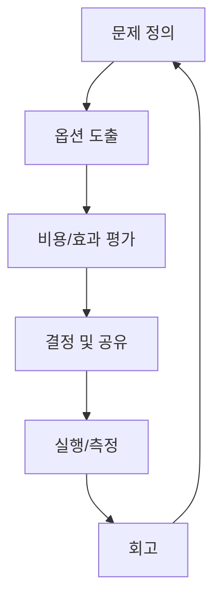

리더십의 본질은 더 많이 아는 것이 아니라, 팀이 더 빨리 배우게 만드는 것입니다.

## 리더의 운영 보드

| 보드 | 질문 | 업데이트 주기 |
|---|---|---|
| 목표 보드 | 지금 가장 중요한 3개는 무엇인가 | 주간 |
| 위험 보드 | 실패 가능성이 높은 영역은 어디인가 | 주간 |
| 인재 보드 | 누가 성장하고, 누가 막혀 있는가 | 격주 |

## 의사결정 루프

## 결론

좋은 리더는 답을 주는 사람이 아니라, 팀이 답을 찾는 시스템을 만드는 사람입니다.

