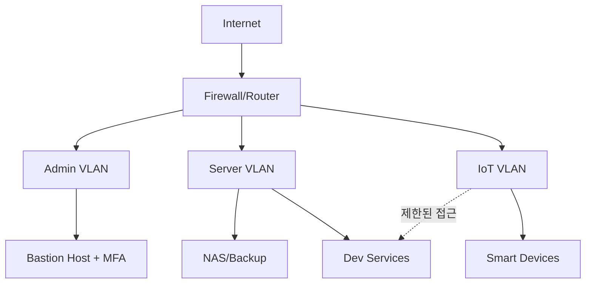

홈랩은 학습과 실험에 최적이지만, 보안 관점에서는 "작은 데이터센터"와 같습니다.  
편의성만 우선하면 내부망 전체가 노출되기 쉽고, 백업이 없으면 장애 1회로 모든 자산을 잃을 수 있습니다.

## 위협 모델 먼저 정의하기

| 위협 | 현실 시나리오 | 영향 |
|---|---|---|
| 계정 탈취 | 약한 비밀번호, 재사용 | 원격 접속 장악 |
| 노출 포트 공격 | 관리 포트 직접 오픈 | 서비스 변조/랜섬웨어 |
| 내부망 횡적 이동 | IoT 취약점 악용 | NAS/개발 서버 감염 |
| 백업 부재 | 디스크 장애, 실수 삭제 | 장기 데이터 손실 |

## 권장 네트워크 분리 모델

## 보안 설정 우선순위

1. **원격 접속 경로 단일화**: VPN + MFA + Bastion만 허용  
2. **관리 포트 차단**: 외부에서 SSH/RDP 직접 접근 금지  
3. **계정 정책 강화**: 관리자 계정 분리, 키 기반 인증  
4. **로그 중앙화**: 방화벽/서버 로그를 한 곳에 수집  
5. **백업 자동화**: 일간 스냅샷 + 오프사이트 복제

## 장비/서비스별 체크표

| 영역 | 최소 기준 | 권장 기준 |
|---|---|---|
| 라우터/방화벽 | 최신 펌웨어, 관리자 비번 변경 | 구성 백업 + 변경 이력 |
| NAS | RAID + 정기 스냅샷 | 오프사이트 암호화 백업 |
| 서버 | 방화벽 룰 최소화 | 에이전트 기반 침입 탐지 |
| 개발 도구 | 비밀키 로컬 평문 저장 금지 | 시크릿 매니저 사용 |

## 백업 전략: 3-2-1 원칙 실전 적용

- **3개 복사본**: 원본 + 로컬 백업 + 원격 백업  
- **2개 매체**: NAS + 클라우드 또는 외장 디스크  
- **1개 오프사이트**: 다른 물리 위치 저장

| 백업 유형 | 주기 | 복구 목표 |
|---|---|---|
| 코드/문서 증분 | 매일 | 1시간 내 |
| 컨테이너 볼륨 | 매일 | 4시간 내 |
| 전체 이미지 | 주간 | 24시간 내 |

## 사고 대응 런북(요약)

| 단계 | 행동 |
|---|---|
| 탐지 | 비정상 로그인, 트래픽 급증, 무결성 알람 확인 |
| 격리 | 의심 장비 네트워크 분리, 계정 세션 강제 종료 |
| 분석 | 로그 타임라인 정리, 최초 침투 지점 추적 |
| 복구 | 깨끗한 백업으로 복원, 키/비밀번호 전면 교체 |
| 재발 방지 | 룰 강화, 미사용 포트 폐쇄, 점검 자동화 |

## 월간 점검 체크리스트

- [ ] 관리자 계정 MFA가 강제되어 있는가  
- [ ] 외부 노출 포트를 월 1회 점검하는가  
- [ ] 백업 복구 리허설을 실제로 실행했는가  
- [ ] IoT와 서버 네트워크가 분리되어 있는가  
- [ ] 로그 보관 정책과 알람 임계값을 업데이트했는가

## 결론

홈랩 보안의 핵심은 장비 스펙이 아니라 운영 습관입니다.  
네트워크 분리, 접근 제어, 백업 자동화, 로그 점검을 루틴으로 만들면 개인 인프라도 충분히 안정적으로 운영할 수 있습니다.

