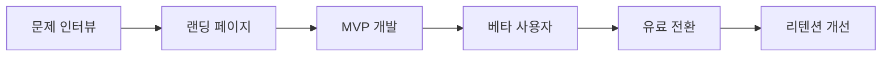

출시 실패의 대부분은 개발력 부족이 아니라 문제 검증 부족에서 시작됩니다.

## 4단계 프레임

| 단계 | 목표 | 핵심 지표 |
|---|---|---|
| Problem | 명확한 문제 확인 | 인터뷰 반응률 |
| MVP | 최소 기능 구현 | 활성 사용자 |
| Paid | 첫 결제 달성 | 결제 전환률 |
| Scale | 반복 성장 | 리텐션/추천률 |

## 결론

빠른 코딩보다 빠른 검증이 중요합니다.  
첫 유료 고객을 만들기 전에는 기능 확장을 최대한 억제하세요.

