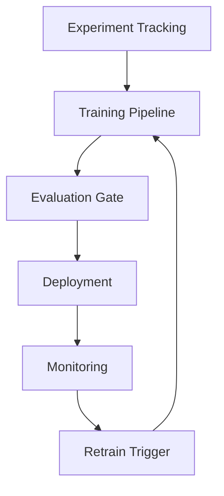

MLOps의 핵심은 모델 파일 배포가 아니라 **학습·추론·데이터·평가가 같은 버전 체계**로 묶이는 것입니다.  
실험 노트만 산재하면, 프로덕션 장애 시 재현이 불가능합니다.

## 라이프사이클 단계

| 단계 | 산출물 | 리스크 |
|---|---|---|
| Experiment | 실험 ID, 파라미터, 메트릭 | 재현 불가 |
| Train | 데이터 스냅샷, 코드 커밋, 아티팩트 | 데이터 누수 |
| Evaluate | 오프라인 지표, 편향 점검 | 지표 착시 |
| Deploy | 모델 버전, 롤백 절차 | 회귀 |
| Monitor | 드리프트, 성능, 비용 | 침묵하는 품질 저하 |

## 배포 패턴

| 패턴 | 설명 |
|---|---|
| Shadow | 신모델은 로그만, 판단은 구모델 |
| Canary | 트래픽 일부만 신모델 |
| Blue-Green | 즉시 스위치, 롤백 용이 |

## 모니터링 최소 세트

| 영역 | 관측 |
|---|---|
| 데이터 | 입력 분포 이동, 결측 급증 |
| 모델 | 정확도·지연·오류율 |
| 비용 | GPU/토큰/배치 비용 |
| 비즈니스 | 전환·이탈·CS 이슈 |

## 재학습 트리거 예시

- 오프라인 지표 대비 온라인 지표 일정 기준 이탈  
- 데이터 드리프트 임계값 초과  
- 정기 캘린더(주간/월간) + 수동 승인  

## 체크리스트

- [ ] 학습 데이터와 추론 입력의 전처리가 동일 코드 경로인가  
- [ ] 모델·코드·데이터 버전이 추적 가능한가  
- [ ] 롤백이 1클릭 또는 짧은 절차로 가능한가  
- [ ] 자동 재학습에 인간 승인 게이트가 있는가  

## 결론

MLOps는 **“모델 서빙”이 아니라 “학습-배포-관측의 닫힌 루프”**입니다.  
게이트와 모니터링을 먼저 고정하면, 실험 속도를 오히려 더 올릴 수 있습니다.
