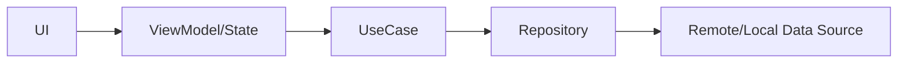

## 레이어 설계 기준

| 레이어 | 책임 | 주의점 |
|---|---|---|
| Presentation | 화면 상태와 사용자 상호작용 | 비즈니스 로직 과다 포함 금지 |
| Domain | 유스케이스와 규칙 | 프레임워크 의존 최소화 |
| Data | API/DB/캐시 연결 | 에러 처리 일관성 확보 |

## 결론

모바일 아키텍처의 핵심은 기술 스택이 아니라 경계 관리입니다.

