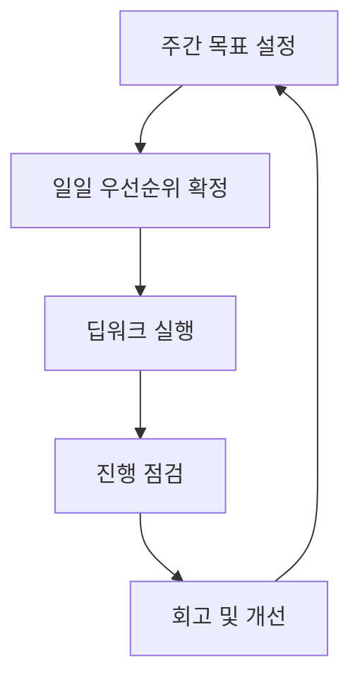

생산성은 더 많이 하는 기술이 아니라, 중요한 일을 먼저 끝내는 기술입니다.

## 주간 설계표

| 구간 | 핵심 행동 | 산출물 |
|---|---|---|
| 월요일 | Top 3 목표 선정 | 주간 목표 문서 |
| 화-목 | 딥워크 블록 실행 | 핵심 결과물 |
| 금요일 | 주간 회고 | 개선 액션 2개 |

## 결론

도구보다 루프가 중요합니다.  
주간 목표-일일 실행-금요일 회고가 고정되면 성과는 안정적으로 누적됩니다.

