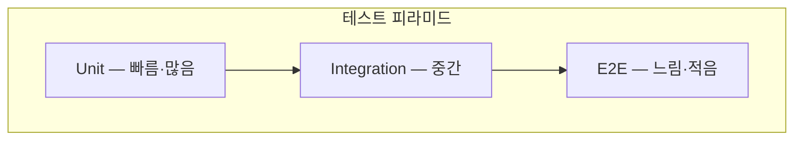

QA 자동화의 목표는 테스트 개수가 아니라 **릴리스 결정을 빠르고 안전하게 만드는 것**입니다.  
E2E만 늘리면 피드백이 느려지고, 단위만 늘리면 사용자 시나리오 공백이 생깁니다.

## 테스트 피라미드 가이드(실무형)

| 층 | 비중(가이드) | 역할 | 주의 |
|---|---:|---|---|
| 단위 | 많음 | 순수 로직·엣지 케이스 | mock 과다로 신뢰도 하락 방지 |
| 통합 | 중간 | DB·메시지·외부 API 계약 | 테스트 데이터 전략 필요 |
| E2E | 적음 | 핵심 사용자 여정 | 느리면 스모크 위주로 유지 |
| 성능/부하 | 필요 시 | SLO 관련 경로 | 프로덕션 유사 환경 |

## CI 게이트 설계

| 게이트 | 조건 예시 |
|---|---|
| PR | 단위 + 린트 + 타입체크 |
| Merge to main | 통합 테스트 + 계약 테스트 |
| Release candidate | E2E 스모크 + 마이그레이션 검증 |
| 프로덕션 | 카나리·롤백 자동화 |

## 품질 지표

| 지표 | 설명 |
|---|---|
| 변경 실패율 | 배포 후 핫픽스 비율 |
| 결함 탈출률 | 프로덕션 발견 / 전체 결함 |
| MTTR | 장애 복구 시간 |
| 테스트 플레이키율 | 불안정 테스트 비율 |

## 도입 90일 로드맵

| 기간 | 목표 |
|---|---|
| 1~30일 | 핵심 사용자 여정 3~5개 정의, E2E 스모크 고정 |
| 31~60일 | 통합 테스트 데이터 표준화, 계약 테스트 추가 |
| 61~90일 | 품질 대시보드, 플레이키 테스트 제거 스프린트 |

## 체크리스트

- [ ] “출시하면 안 되는 것”을 테스트로 표현할 수 있는가  
- [ ] 실패 시 원인 파악에 평균 30분 이내가 걸리는가  
- [ ] E2E가 PR마다 전부 도는 구조는 아닌가(병목)  
- [ ] 테스트와 프로덕션 설정 차이가 문서화되어 있는가  

## 결론

자동화는 **피라미드 균형 + CI 게이트 + 지표**가 맞을 때 팀 속도와 품질이 동시에 좋아집니다.  
완벽한 커버리지보다, 회귀가 나올 때마다 “한 겹 더 쌓는” 습관이 더 중요합니다.
