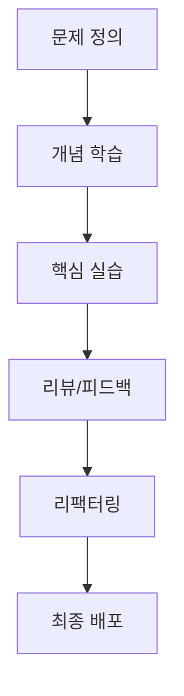

좋은 커리큘럼은 강의량이 아니라 학습자의 행동 변화를 만듭니다.

## 설계 프레임

| 단계 | 질문 | 산출물 |
|---|---|---|
| 목표 정의 | 학습 후 무엇을 할 수 있어야 하는가 | 성과 기준 |
| 모듈 설계 | 어떤 순서가 실패를 줄이는가 | 주차별 모듈 |
| 실습 설계 | 어떤 과제가 실무와 유사한가 | 프로젝트 시나리오 |
| 평가 설계 | 어떤 지표로 성장을 확인할까 | 루브릭, 체크리스트 |

## 커리큘럼 흐름

## 성과 지표

| 지표 | 권장 목표 |
|---|---|
| 완주율 | 70% 이상 |
| 과제 제출률 | 85% 이상 |
| 실무 적용률(1개월) | 50% 이상 |
| 재수강/추천률 | 30% 이상 |

## 결론

교육은 콘텐츠 산업이 아니라 성과 산업입니다.  
목표-실습-피드백-배포 구조를 고정하면 학습자의 실제 전환률이 올라갑니다.

