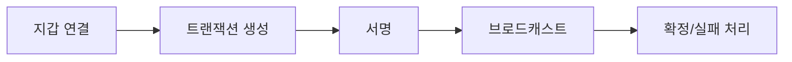

Web3 제품의 핵심은 체인 기술이 아니라 실패를 설명하는 UX입니다.

## 핵심 체크포인트

| 항목 | 질문 |
|---|---|
| 지갑 연결 | 연결 실패 시 대안 흐름이 있는가 |
| 서명 요청 | 사용자가 의미를 이해할 수 있는가 |
| 수수료 | 예상 가스비를 미리 보여주는가 |
| 실패 처리 | 재시도/대기/취소 정책이 명확한가 |

## 결론

Web3 제품은 기술보다 신뢰 UX가 먼저입니다.

