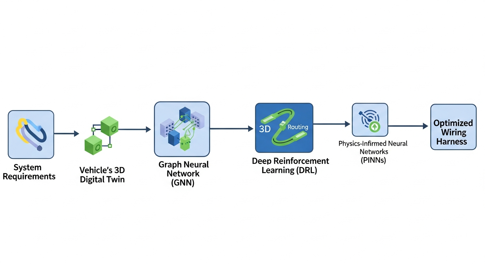
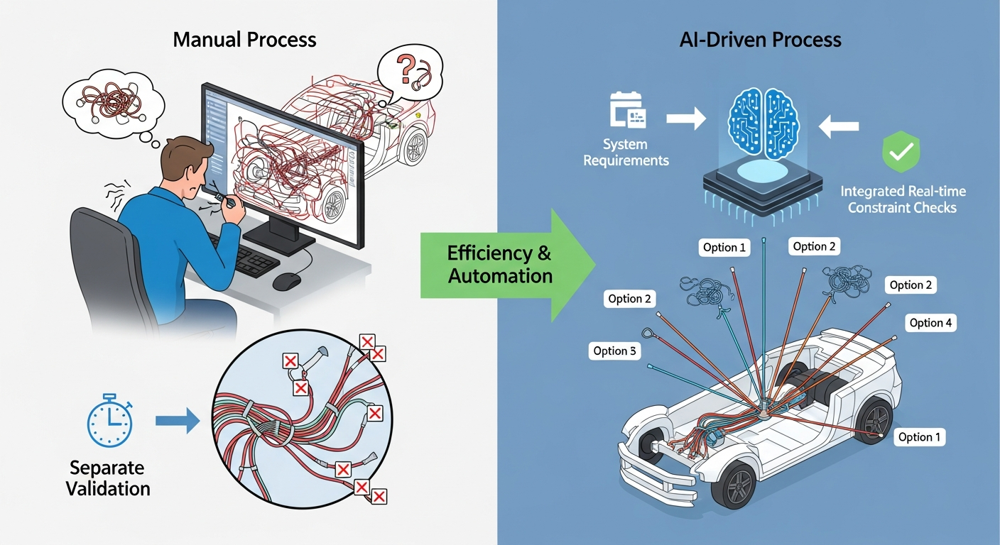

## 무슨 일이 있었나

전기 자동차(EV), 자율주행차, 그리고 도심항공교통(UAM)의 발전으로 인해 이동 수단 내부에 탑재되는 전자 장비의 수가 기하급수적으로 증가하고 있습니다. 이에 따라 차량이나 항공기의 신경망 역할을 하는 **와이어링 하네스(Wiring Harness, 전선 다발)**의 복잡도 역시 한계에 다다랐습니다. 기존의 하네스 엔지니어링은 엔지니어가 2D 회로도를 바탕으로 3D CAD 소프트웨어 상에서 수동으로 경로를 설정하고, 물리적/전기적 제약 조건을 일일이 확인해야 하는 노동 집약적인 작업이었습니다.

최근 몇 년 사이, Siemens, Dassault Systèmes, Zuken 등 주요 CAD 솔루션 벤더와 제조 분야 AI 스타트업들을 중심으로 **하네스 엔지니어링에 생성형 AI(Generative AI)를 도입하는 움직임**이 본격화되었습니다. 단순히 기존에 그려진 선을 다듬어주는 수준을 넘어, 시스템 요구사항(예: 센서 A와 제어기 B의 연결, 허용 전류, 데이터 통신 규격)만 입력하면 AI가 차량의 3D 모델(Digital Twin)을 분석하여 최적의 배선 토폴로지와 3D 라우팅 경로를 자동으로 생성해 내는 기술이 실무에 적용되기 시작했습니다.

이러한 변화는 하네스 설계에 소요되는 시간을 수개월에서 수일, 수시간 단위로 단축시킬 뿐만 아니라, 인간이 놓치기 쉬운 최적화 포인트를 찾아내어 전체 케이블의 무게와 원가를 획기적으로 절감하는 성과를 내고 있습니다.


## 왜 중요한가

하네스는 자동차에서 엔진(또는 배터리), 섀시 다음으로 무겁고 비용이 많이 드는 부품입니다.

1. **무게 및 비용 절감의 한계 돌파**: EV 시대에는 주행거리 확보를 위해 경량화가 필수적입니다. AI는 수백만 가지의 경로 조합을 탐색하여 가장 짧으면서도 안전한 경로를 찾아냅니다. 이는 구리선 사용량을 줄여 직접적인 원가 절감과 차량 경량화로 이어집니다.
2. **복잡성 관리의 자동화**: 자율주행 레벨이 올라갈수록 센서 데이터 처리를 위한 고속 통신 케이블이 증가합니다. 전력선과 통신선이 가까이 배치될 경우 발생하는 전자기 간섭(EMI) 문제를 사람이 3D 공간에서 모두 예측하고 피하는 것은 불가능에 가깝습니다. AI 모델은 이러한 다차원적인 제약 조건을 동시에 고려하여 설계를 생성합니다.
3. **엔지니어링 소프트웨어 패러다임의 전환**: 개발자 및 소프트웨어 아키텍트 관점에서 이는 단순한 '기능 추가'가 아닙니다. 전통적인 룰 기반(Rule-based)의 기하학적 연산(예: Dijkstra 알고리즘을 이용한 최단 거리 탐색)에서, 데이터 기반의 확률적 생성 모델과 강화학습 에이전트 기반으로 코어 엔진이 교체되고 있음을 의미합니다.


## 기술적 분석

하네스 엔지니어링 AI 생성 시스템은 크게 **데이터 표현(Data Representation)**, **토폴로지 생성(Topology Generation)**, 그리고 **3D 공간 라우팅(3D Spatial Routing)**의 세 가지 기술적 기둥으로 구성됩니다.



### 1. 데이터 표현: 그래프(Graph) 구조의 활용
하네스 시스템은 본질적으로 노드(Node, 커넥터 및 스플라이스)와 엣지(Edge, 와이어 및 번들)로 이루어진 그래프입니다. AI가 이를 이해하기 위해 **그래프 신경망(GNN, Graph Neural Networks)**이 주로 사용됩니다.
* **Node Features**: 커넥터의 핀 수, 허용 전압/전류, 위치 좌표, 열 저항 한계.
* **Edge Features**: 와이어의 굵기(AWG), 차폐(Shielding) 여부, 길이, 유연성.

GNN은 과거의 성공적인 하네스 설계 데이터베이스를 학습하여, 특정 시스템 아키텍처가 주어졌을 때 어떤 형태의 그래프(토폴로지)가 가장 안정적이고 효율적인지 추론합니다.

### 2. 3D 공간 라우팅: 심층 강화학습(DRL)
2D 논리 회로가 완성되면, 이를 실제 3D 기구물(차체, 항공기 프레임) 내부에 배치해야 합니다. 이때는 **심층 강화학습(Deep Reinforcement Learning)**이 강력한 성능을 발휘합니다.
에이전트(Agent)는 3D 공간을 탐색하며 배선 경로를 생성하고, 환경(Environment)으로부터 보상(Reward) 또는 페널티를 받습니다.

* **상태(State)**: 현재까지 라우팅된 경로, 남은 목표 지점, 주변 장애물(차체 부품)의 3D 복셀(Voxel) 정보 또는 포인트 클라우드(Point Cloud).
* **행동(Action)**: 다음 경로의 방향 및 길이 결정 (x, y, z 벡터).
* **보상 함수(Reward Function)**:
  * 목표 도달 시 큰 보상.
  * 경로가 짧을수록 추가 보상.
  * **페널티**: 장애물 충돌, 최소 곡률 반경(Minimum Bend Radius) 위반, 고온 발생 부품(엔진, 배기구)에 근접, 전력선과 통신선 간의 이격 거리(Clearance) 위반.

아래는 DRL 환경을 구성하는 파이썬 기반의 수도 코드(Pseudo-code) 예시입니다.

```python
class HarnessRoutingEnv:
    def __init__(self, cad_model, start_node, end_node, constraints):
        self.cad_model = cad_model # 3D 환경 (장애물, 열원 등)
        self.start = start_node
        self.end = end_node
        self.constraints = constraints # 곡률 반경, EMI 이격 거리 등
        self.current_path = [self.start]

    def step(self, action):
        # 행동(방향 벡터)에 따라 다음 위치 계산
        next_pos = self._calculate_next_pos(self.current_path[-1], action)

        # 충돌 및 제약 조건 검사
        is_collision = self.cad_model.check_collision(next_pos)
        bend_radius_violation = self._check_bend_radius(self.current_path, next_pos)

        reward = 0
        done = False

        if is_collision or bend_radius_violation:
            reward = -100 # 강력한 페널티
            done = True
        elif self._is_reached(next_pos, self.end):
            reward = 1000 # 목표 도달 보상
            done = True
        else:
            # 목표 방향으로 나아갈수록 작은 보상, 길어질수록 페널티
            reward = self._calculate_distance_reward(next_pos)
            self.current_path.append(next_pos)

        return self._get_state(), reward, done, {}
```

### 3. 검증 및 최적화: 물리 정보 기반 신경망(PINN)
생성된 경로가 물리적으로 타당한지 검증하기 위해 **PINN(Physics-Informed Neural Networks)**이 도입되기도 합니다. 기존에는 유한요소해석(FEA)을 통해 케이블의 처짐(Sag)이나 진동에 의한 마모를 시뮬레이션했으나, 연산 비용이 매우 높았습니다. PINN을 활용하면 물리 법칙을 손실 함수(Loss function)에 포함하여 학습하므로, AI가 생성 단계에서부터 물리적 타당성을 갖춘 경로를 실시간에 가깝게 제안할 수 있습니다.


## 기존 대비 달라진 점



| 구분 | 기존 하네스 엔지니어링 (Rule-based / Manual) | AI 생성 기반 하네스 엔지니어링 (Generative AI) |
| :--- | :--- | :--- |
| **설계 방식** | 엔지니어가 2D 회로도를 보고 3D 공간에서 수동으로 스플라인(Spline)을 그림 | 시스템 요구사항 입력 시 AI가 다수의 3D 라우팅 대안을 자동 생성 및 제안 |
| **경로 탐색 알고리즘** | Dijkstra, A* 기반의 단순 최단 거리 탐색 (다중 제약 조건 반영 어려움) | 심층 강화학습(DRL) 기반. 열, EMI, 진동 등 복합 제약 조건을 동시 고려 |
| **설계 변경 대응** | 기구부(차체) 설계 변경 시 하네스 경로 전체를 수동으로 재수정 | 기구부 변경을 인식하여 실시간으로 경로 자동 재라우팅(Auto-Rerouting) |
| **검증(Validation)** | 설계 완료 후 별도의 해석 툴을 통해 배치(Batch) 작업으로 검증. 오류 시 재설계 반복 | 생성 과정 자체에 보상 함수로 제약 조건이 포함되어, Correct-by-Construction 달성 |
| **지식 자산화** | 베테랑 엔지니어의 개인적인 경험과 노하우에 의존 | 과거 설계 데이터(PLM/CAD)를 학습하여 기업의 설계 노하우를 모델 가중치로 자산화 |


## 개발자에게 미치는 영향

하네스 엔지니어링 생태계에 AI가 도입되면서, 이 분야의 소프트웨어 개발자와 데이터 엔지니어들에게는 다음과 같은 새로운 요구사항과 기회가 발생하고 있습니다.

1. **CAD API 및 플러그인 개발 역량 강화**
   AI 모델이 독립적으로 동작하는 것만으로는 실무적 가치가 없습니다. 생성된 결과를 CATIA, NX, AutoCAD Electrical 등 상용 CAD 소프트웨어에 즉시 반영할 수 있어야 합니다. 개발자들은 C++, C#, Python 등을 활용하여 CAD 벤더가 제공하는 복잡한 API를 다루고, AI 백엔드 서버와 CAD 프론트엔드를 연결하는 매끄러운 플러그인(Add-in) 아키텍처를 설계해야 합니다.

2. **비정형 레거시 데이터의 파이프라인 구축**
   AI를 학습시키기 위해서는 과거의 설계 데이터가 필수적입니다. 그러나 대부분의 제조 데이터는 XML, PLMXML, STEP, IGES 등 다양한 포맷으로 파편화되어 있으며, 휴먼 에러가 포함되어 있습니다. 개발자는 이러한 이기종 CAD 데이터를 파싱(Parsing)하고, 노이즈를 제거하여 GNN이나 DRL 모델이 학습할 수 있는 정형화된 그래프/텐서 데이터로 변환하는 강력한 데이터 파이프라인을 구축해야 합니다.

3. **실시간 3D 렌더링 및 추론 최적화**
   수만 개의 부품으로 이루어진 3D 어셈블리 환경에서 AI 에이전트가 실시간으로 경로를 탐색하고 추론 결과를 화면에 렌더링하는 것은 엄청난 컴퓨팅 자원을 요구합니다. WebGL, OpenGL 등을 활용한 경량화된 3D 시각화 기술과, ONNX, TensorRT 등을 이용한 AI 모델의 추론 속도(Inference Speed) 최적화가 핵심 개발 과제가 됩니다.

4. **도메인 지식(Domain Knowledge)의 융합**
   단순한 소프트웨어 엔지니어링을 넘어, 기계공학적 제약(곡률 반경, 장력)과 전기전자공학적 제약(전압 강하, EMI)을 코드로 모델링할 수 있는 능력이 요구됩니다. 도메인 전문가와의 긴밀한 협업을 통해 물리적 수식을 AI의 손실 함수나 보상 함수로 변환하는 알고리즘 설계 역량이 중요해집니다.


## 앞으로의 전망

**단기적으로는 '코파일럿(Copilot)' 형태의 도입이 주를 이룰 것입니다.**
완전한 자동화보다는, 엔지니어가 시작점과 끝점을 지정하면 AI가 3~4개의 유력한 경로 옵션을 추천하고, 엔지니어가 이를 선택 및 미세 조정하는 인간-AI 협업 모델이 CAD 소프트웨어의 기본 기능으로 자리 잡을 것입니다. 이는 개발자들에게 기존 UI/UX를 해치지 않으면서 AI 제안을 자연스럽게 통합하는 인터페이스 설계의 중요성을 부각시킬 것입니다.

**중장기적으로는 '요구사항 기반의 완전 자동 생성(Requirements-to-Design)'으로 진화할 전망입니다.**
텍스트나 시스템 블록 다이어그램 수준의 상위 요구사항만 입력하면, AI가 논리 회로 설계부터 3D 라우팅, 그리고 제조 공장용 2D 도면(Nailboard drawing)과 자재 명세서(BOM) 추출까지 전 과정을 파이프라인으로 자동화할 것입니다. 더 나아가, 디지털 트윈(Digital Twin) 기술과 결합하여, 가상 공간에서 차량이 주행할 때 발생하는 진동과 열 변화를 실시간으로 시뮬레이션하고, 이를 바탕으로 하네스 설계가 스스로 진화(Evolutionary Design)하는 수준에 도달할 것으로 예상됩니다.

